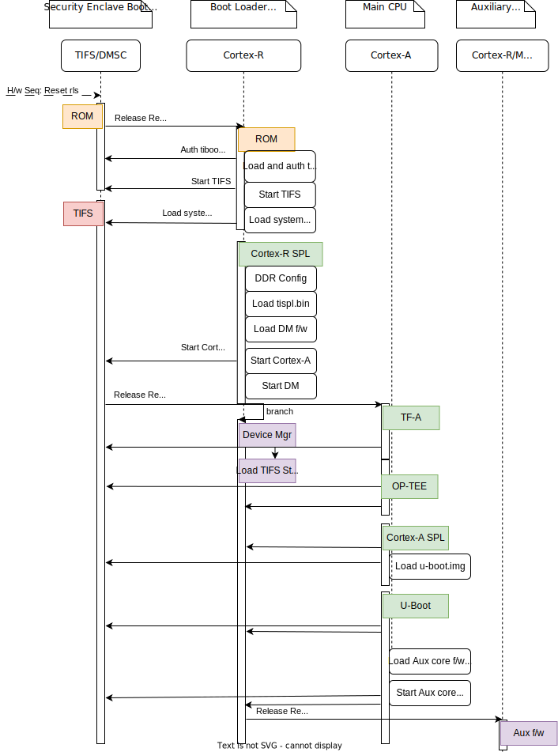

.. SPDX-License-Identifier: GPL-2.0+ OR BSD-3-Clause
.. sectionauthor:: Randolph Sapp <rs@ti.com>

AM62 Beagleboard.org PocketBeagle 2
===================================

Introduction:
-------------

BeagleBoard.org PocketBeagle 2 is an easy to use, affordable open source
hardware single board computer based on the Texas Instruments AM625
SoC.

Further information can be found at:

* Product Page: https://www.beagleboard.org/boards/pocketbeagle-2
* Hardware documentation: https://openbeagle.org/pocketbeagle/pocketbeagle-2

Boot Flow:
----------
Below is the pictorial representation of boot flow:

On this platform, 'TI Foundational Security' (TIFS) functions as the security
enclave master while 'Device Manager' (DM), also known as the 'TISCI server' in
"TI terminology", offers all the essential services. The A53 or M4F (Aux core)
sends requests to TIFS/DM to accomplish these services, as illustrated in the
diagram above.

Sources:
--------
.. include::  ../ti/k3.rst
   :start-after: .. k3_rst_include_start_boot_sources
   :end-before: .. k3_rst_include_end_boot_sources

.. include::  ../ti/k3.rst
   :start-after: .. k3_rst_include_start_boot_firmwares
   :end-before: .. k3_rst_include_end_tifsstub

Build procedure:
----------------

#. Setup the environment variables:

   .. include::  ../ti/k3.rst
      :start-after: .. k3_rst_include_start_common_env_vars_desc
      :end-before: .. k3_rst_include_end_common_env_vars_desc

   .. include::  ../ti/k3.rst
      :start-after: .. k3_rst_include_start_board_env_vars_desc
      :end-before: .. k3_rst_include_end_board_env_vars_desc

#. Set the variables corresponding to this platform:

   .. include::  ../ti/k3.rst
      :start-after: .. k3_rst_include_start_common_env_vars_defn
      :end-before: .. k3_rst_include_end_common_env_vars_defn

   .. prompt:: bash $

      export UBOOT_CFG_CORTEXR=am62_pocketbeagle2_r5_defconfig
      export UBOOT_CFG_CORTEXA=am62_pocketbeagle2_a53_defconfig
      export TFA_BOARD=lite
      export TFA_EXTRA_ARGS="PRELOADED_BL33_BASE=0x82000000 BL32_BASE=0x80080000"
      export OPTEE_PLATFORM=k3-am62x
      export OPTEE_EXTRA_ARGS="CFG_TZDRAM_START=0x80080000"

   .. include::  ../ti/am62x_sk.rst
      :start-after: .. am62x_evm_rst_include_start_build_steps
      :end-before: .. am62x_evm_rst_include_end_build_steps

Target Images
-------------
Copy these images to an SD card and boot:

   * :file:`tiboot3.bin` from Cortex-R5 build.
   * :file:`tispl.bin` and :file:`u-boot.img` from Cortex-A build

Image formats
-------------

- :file:`tiboot3.bin`

  .. image:: ../ti/img/multi_cert_tiboot3.bin.svg
     :alt: tiboot3.bin image format

- :file:`tispl.bin`

  .. image:: ../ti/img/tifsstub_dm_tispl.bin.svg
     :alt: tispl.bin image format

Additional hardware for U-Boot development
------------------------------------------

* A Serial Console is critical for U-Boot development on the PocketBeagle 2. See
  `PocketBeagle 2 serial console documentation`__.
* uSD is the default, and a SD/MMC reader will be needed.
* (optionally) JTAG is useful when working with very early stages of boot.

.. __: https://docs.beagleboard.org/boards/pocketbeagle-2/03-design-and-specifications.html#serial-debug-port

Default storage options
-----------------------

There is only one storage media option for the PocketBeagle 2, by default:

* SD/MMC card interface

Flash to uSD card
-----------------

If you choose to  hand format your own bootable uSD card, be
aware that it can be difficult. The following information
may be helpful, but remember that it is only sometimes
reliable, and partition options can cause issues. These
can potentially help:

* https://git.ti.com/cgit/arago-project/tisdk-setup-scripts/tree/create-sdcard.sh
* https://elinux.org/Beagleboard:Expanding_File_System_Partition_On_A_microSD

The simplest option is to start with a standard distribution
image like those in `BeagleBoard.org Distros Page
<https://www.beagleboard.org/distros>`_ and download a disk image for
PocketBeagle 2. Pick a 16GB+ uSD card to be on the safer side.

With an SD/MMC Card reader and `Balena Etcher
<https://etcher.balena.io/>`_, having a functional setup in minutes is
a trivial matter, and it works on almost all host operating systems.

Updating U-Boot is a matter of copying the :file:`tiboot3.bin`,
:file:`tispl.bin` and :file:`u-boot.img` to the "BOOT" partition of the uSD
card. Remember to sync and unmount (or Eject - depending on the Operating
System) the uSD card prior to physically removing from SD card reader.

Also see following section on switch setting used for booting using
uSD card.

.. note::

   If you are frequently working with uSD cards, you might find the
   following useful:

   * `USB-SD-Mux <https://www.linux-automation.com/en/products/usb-sd-mux.html>`_
   * `SD-Wire <https://wiki.tizen.org/SDWire>`_

LED patterns during boot
------------------------

.. list-table:: USR LED status indication
   :widths: 16 16
   :header-rows: 1

   * - USR LEDs (1234)
     - Indicates

   * - 0000
     - Boot failure or R5 image not started up

   * - 1111
     - A53 SPL/U-boot has started up

   * - 1010
     - OS boot process has been initiated

   * - 0101
     - OS boot process failed and drops to U-Boot shell

.. note::

   In the table above, 0 indicates LED switched off and 1 indicates LED
   switched ON.

.. warning::

   If the "red" power LED is not glowing, the system power supply is not
   functional. Please refer to the `PocketBeagle 2 documentation
   <https://docs.beagleboard.org/boards/pocketbeagle-2/>`_ for further
   information.

A53 SPL DDR Memory Layout
-------------------------

.. include::  ../ti/am62x_sk.rst
   :start-after: .. am62x_evm_rst_include_start_ddr_mem_layout
   :end-before: .. am62x_evm_rst_include_end_ddr_mem_layout

Switch Setting for Boot Mode
----------------------------

The boot time option is configured via "USR" button on the board. See the
`PocketBeagle 2 Schematics
<https://git.beagleboard.org/pocketbeagle/pocketbeagle-2/-/blob/main/pocketbeagle2_sch.pdf>`_
and the `PocketBeagle 2 documentation on Boot Modes
<https://docs.beagleboard.org/boards/pocketbeagle-2/03-design-and-specifications.html#boot-modes>`_
for details.

.. list-table:: Boot Modes
   :widths: 16 16 16
   :header-rows: 1

   * - USR Button Status
     - Primary Boot
     - Secondary Boot

   * - Not Pressed
     - uSD
     - USB Device Firmware Upgrade (DFU) mode

   * - Pressed
     - uSD
     - UART

To switch boot modes, hold the "USR" button while powering on the device with a
USB type C power supply. Release the button when the red power LED lights up.

DFU based boot
--------------

To boot the board over DFU, ensure there is no SD card inserted with a
bootloader. After power-on the build artifacts needs to be uploaded one by one
with a tool like dfu-util.

.. include::  ../ti/am62x_sk.rst
   :start-after: .. am62x_evm_rst_include_start_dfu_boot
   :end-before: .. am62x_evm_rst_include_end_dfu_boot

Debugging U-Boot
----------------

See :ref:`Common Debugging environment - OpenOCD <k3_rst_refer_openocd>`: for
detailed setup and debugging information.

.. warning::

   **OpenOCD support since**: v0.12.0

   If the default package version of OpenOCD in your development
   environment's distribution needs to be updated, it might be necessary to
   build OpenOCD from the source.

.. include::  ../ti/k3.rst
   :start-after: .. k3_rst_include_start_openocd_connect_tag_connect
   :end-before: .. k3_rst_include_end_openocd_connect_tag_connect

.. include::  ../ti/k3.rst
   :start-after: .. k3_rst_include_start_openocd_cfg_external_intro
   :end-before: .. k3_rst_include_end_openocd_cfg_external_intro

For example, with the PocketBeagle 2 (AM62X platform), the
:file:`openocd_connect.cfg` would look like:

.. code-block:: tcl

   # TUMPA example:
   # http://www.tiaowiki.com/w/TIAO_USB_Multi_Protocol_Adapter_User's_Manual
   source [find interface/ftdi/tumpa.cfg]

   transport select jtag

   # default JTAG configuration has only SRST and no TRST
   reset_config srst_only srst_push_pull

   # delay after SRST goes inactive
   adapter srst delay 20

   if { ![info exists SOC] } {
     # Set the SoC of interest
     set SOC am625
   }

   source [find target/ti_k3.cfg]

   ftdi tdo_sample_edge falling

   # Speeds for FT2232H are in multiples of 2, and 32MHz is tops
   # max speed we seem to achieve is ~20MHz.. so we pick 16MHz
   adapter speed 16000
