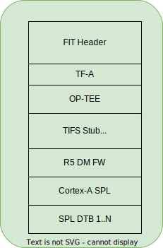

.. SPDX-License-Identifier: GPL-2.0+ OR BSD-3-Clause
.. sectionauthor:: Nishanth Menon <nm@ti.com>

AM67A Beagleboard.org BeagleY-AI
================================

Introduction:
-------------

BeagleBoard.org BeagleY-AI is an easy to use, affordable open source
hardware single board computer based on the Texas Instruments AM67A,
which features a quad-core 64-bit Arm CPU subsystem, 2 general-purpose
digital-signal-processors (DSP) and matrix-multiply-accelerators (MMA),
GPU, vision and deep learning accelerators, and multiple Arm Cortex-R5
cores for low-power, low-latency GPIO control.

Further information can be found at:

* Product Page: https://beagley-ai.org/
* Hardware documentation: https://openbeagle.org/beagley-ai/beagley-ai

Boot Flow:
----------
Below is the pictorial representation of boot flow:

.. image:: ../ti/img/boot_diagram_k3_current.svg
  :alt: Boot flow diagram

- On this platform, 'TI Foundational Security' (TIFS) functions as the
  security enclave master while 'Device Manager' (DM), also known as the
  'TISCI server' in "TI terminology", offers all the essential services.
  The A53 or R5F (Aux core) sends requests to TIFS/DM to accomplish these
  services, as illustrated in the diagram above.

Sources:
--------
.. include::  ../ti/k3.rst
    :start-after: .. k3_rst_include_start_boot_sources
    :end-before: .. k3_rst_include_end_boot_sources

.. include::  ../ti/k3.rst
    :start-after: .. k3_rst_include_start_boot_firmwares
    :end-before: .. k3_rst_include_end_tifsstub

Build procedure:
----------------
0. Setup the environment variables:

.. include::  ../ti/k3.rst
    :start-after: .. k3_rst_include_start_common_env_vars_desc
    :end-before: .. k3_rst_include_end_common_env_vars_desc

.. include::  ../ti/k3.rst
    :start-after: .. k3_rst_include_start_board_env_vars_desc
    :end-before: .. k3_rst_include_end_board_env_vars_desc

Set the variables corresponding to this platform:

.. include::  ../ti/k3.rst
    :start-after: .. k3_rst_include_start_common_env_vars_defn
    :end-before: .. k3_rst_include_end_common_env_vars_defn
.. prompt:: bash $

  export UBOOT_CFG_CORTEXR=am67a_beagley_ai_r5_defconfig
  export UBOOT_CFG_CORTEXA=am67a_beagley_ai_a53_defconfig
  export TFA_BOARD=lite
  # we dont use any extra TFA parameters
  unset TFA_EXTRA_ARGS
  export OPTEE_PLATFORM=k3-am62x

.. include::  ../ti/j722s_evm.rst
    :start-after: .. j722s_evm_rst_include_start_build_steps
    :end-before: .. j722s_evm_rst_include_end_build_steps

Target Images
-------------
Copy these images to an SD card and boot:

* tiboot3-j722s-hs-fs-evm.bin from Cortex-R5 build as tiboot3.bin.
* tispl.bin and u-boot.img from Cortex-A build.

Image formats
-------------

- tiboot3.bin

.. image:: ../ti/img/multi_cert_tiboot3.bin.svg
  :alt: tiboot3.bin image format

- tispl.bin

Additional hardware for U-Boot development
------------------------------------------

* Serial Console is critical for U-Boot development on BeagleY-AI. See
  `BeagleY-AI serial console documentation
  <https://docs.beagleboard.org/boards/beagley/ai/02-quick-start.html#beagley-ai-headless>`_.
* The only onboard storage option is uSD.
* (optionally) JTAG is useful when working with very early stages of boot.

Flash to uSD card or how to deal with "bricked" Board
-----------------------------------------------------

The only storage option on the platform is uSD card. However, if you
choose to hand format your own bootable uSD card, be aware that it can
be difficult. The following information may be helpful, but remember
that it is only sometimes reliable, and partition options can cause
issues. These can potentially help:

* https://git.ti.com/cgit/arago-project/tisdk-setup-scripts/tree/create-sdcard.sh
* https://elinux.org/Beagleboard:Expanding_File_System_Partition_On_A_microSD
* Or manually as follows (may not take into distro needs such as EFI or swap):

.. prompt:: bash #

  # Create image with partition table
  parted --script <SD CARD DEVICE> \
        mklabel msdos \
        mkpart primary fat16 4MiB 20MiB \
        mkpart primary ext4 20MiB 100% \
        set 1 boot on \
        set 1 bls_boot off \
        set 1 lba on
  # Create boot partition
  mkfs.vfat <SD CARD DEVICE>1
  # Create root partition
  mkfs.ext4 <SD CARD DEVICE>2

The simplest option is to start with a standard distribution
image like those in `BeagleBoard.org Distros Page
<https://www.beagleboard.org/distros>`_ and download a disk image for
BeagleY-AI. Pick a 16GB+ uSD card to be on the safer side.

With an SD/MMC Card reader and `Balena Etcher
<https://etcher.balena.io/>`_, having a functional setup in minutes is
a trivial matter, and it works on almost all Host Operating Systems.
Yes Windows users, Windows Subsystem for Linux(WSL) based development
with U-Boot and update uSD card is practical.

Updating U-Boot is a matter of copying the tiboot3.bin, tispl.bin and
u-boot.img to the "BOOT" partition of the uSD card. Remember to sync
and unmount (or Eject - depending on the Operating System) the uSD
card prior to physically removing from SD card reader.

.. note::
  Great news! If the board has not been damaged physically, there's no
  need to worry about it being "bricked" on this platform. You only have
  to flash an uSD card, plug it in. This means that even if you make a
  mistake, you can quickly fix it and rest easy.

  If you are frequently working with uSD cards, you might find the
  following useful:

  * `USB-SD-Mux <https://www.linux-automation.com/en/products/usb-sd-mux.html>`_
  * `SD-Wire <https://wiki.tizen.org/SDWire>`_

LED patterns during boot
------------------------

.. list-table:: LED status indication as system boots up
   :widths: 16 16
   :header-rows: 1

   * - LED Color
     - Indicates

   * - Only RED at startup
     - Boot failure or R5 image not started up

   * - Steady Green
     - A53 U-boot has started up

   * - Red/Orange
     - OS boot process has been initiated

   * - Steady Green
     - OS boot process failed and drops to U-Boot shell

.. warning ::

  If the "red" power LED is not glowing, the system power supply is not
  functional. Please refer to `BeagleY-AI documentation
  <https://beagley-ai.org/>`_ for further information.

A53 SPL DDR Memory Layout
-------------------------

.. include::  ../ti/j722s_evm.rst
    :start-after: .. j722s_evm_rst_include_start_ddr_mem_layout
    :end-before: .. j722s_evm_rst_include_end_ddr_mem_layout

Debugging U-Boot
----------------

See :ref:`Common Debugging environment - OpenOCD<k3_rst_refer_openocd>`: for
detailed setup and debugging information.

.. warning::

  **OpenOCD support since**: commit 33749a7fbeb5

  If the default package version of OpenOCD in your development
  environment's distribution needs to be updated, it might be necessary to
  build OpenOCD from the source.

.. include::  ../ti/k3.rst
    :start-after: .. k3_rst_include_start_openocd_connect_tag_connect
    :end-before: .. k3_rst_include_end_openocd_connect_tag_connect

.. include::  ../ti/k3.rst
    :start-after: .. k3_rst_include_start_openocd_cfg_external_intro
    :end-before: .. k3_rst_include_end_openocd_cfg_external_intro

For example, with BeagleY-AI (J722S/AM67A platform), the openocd_connect.cfg:

.. code-block:: tcl

  # TUMPA example:
  # http://www.tiaowiki.com/w/TIAO_USB_Multi_Protocol_Adapter_User's_Manual
  source [find interface/ftdi/tumpa.cfg]

  transport select jtag

  # default JTAG configuration has only SRST and no TRST
  reset_config srst_only srst_push_pull

  # delay after SRST goes inactive
  adapter srst delay 20

  if { ![info exists SOC] } {
    # Set the SoC of interest
    set SOC j722s
  }

  source [find target/ti_k3.cfg]

  ftdi tdo_sample_edge falling

  # Speeds for FT2232H are in multiples of 2, and 32MHz is tops
  # max speed we seem to achieve is ~20MHz.. so we pick 16MHz
  adapter speed 16000
