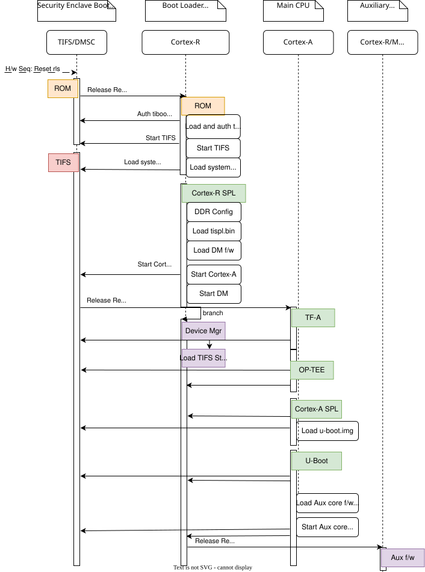
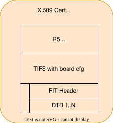
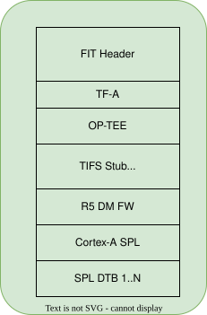

.. SPDX-License-Identifier: GPL-2.0+ OR BSD-3-Clause
.. sectionauthor:: Jai Luthra <j-luthra@ti.com>

AM62A Platforms
===============

Introduction:
-------------
The AM62A SoC family is built on the K3 Multicore SoC architecture platform,
providing a deep learning accelerator, multi-camera support with ISP, video
transcoder and other BOM-saving integrations.
The AM62A SoC enables cost-sensitive automotive applications including driver
and in-cabin monitoring systems, next generation of eMirror system, as well as
a broad set of industrial applications in Factory Automation, Building
Automation, Robotics and more.

Some highlights of this SoC are:

* Quad-Cortex-A53s (running up to 1.4GHz) in a single cluster.
* Cortex-R5F for general-purpose or safety usage.
* Deep Learning Accelerator with Single-core C7x Vector DSP with MMA (up to
  1.0GHz).
* Vision Processing Accelerator (VPAC) with a 315MPixel/s ISP (up to 5MP @
  60fps) supporting 16-bit RAW input with RGB-IR separation.
* 4K Video encoder and decoder for HEVC (Level 5.1 High-tier) and H.264 (Level
  5.2) supporting upto 240MPixels/s and MJPEG encoder at 416MPixels/s
* Single display with 24-bit RGB parallel (DPI) interface supporting upto
  165Mhz pixel clock for 2K resolution.
* Integrated Giga-bit Ethernet switch supporting up to a total of two
  external ports (TSN capable).
* 9xUARTs, 5xSPI, 6xI2C, 2xUSB2, 3xCAN-FD, 3x eMMC and SD, GPMC for
  NAND/FPGA connection, OSPI memory controller, 3xMcASP for audio,
  1x CSI-RX-4L for Camera, eCAP/eQEP, ePWM, among other peripherals.
* Dedicated Centralized System Controller for Security, Power, and
  Resource Management.
* Multiple low power modes support, ex: Deep sleep, Standby, MCU-only,
  enabling battery powered system design.

More details can be found in the Technical Reference Manual:
https://www.ti.com/lit/pdf/spruj16

Platform information:

* https://www.ti.com/tool/SK-AM62A-LP

Boot Flow:
----------
Below is the pictorial representation of boot flow:

- Here TIFS acts as master and provides all the critical services. R5/A53
  requests TIFS to get these services done as shown in the above diagram.

Sources:
--------

.. include::  ../ti/k3.rst
    :start-after: .. k3_rst_include_start_boot_sources
    :end-before: .. k3_rst_include_end_boot_sources

.. include::  ../ti/k3.rst
    :start-after: .. k3_rst_include_start_boot_firmwares
    :end-before: .. k3_rst_include_end_tifsstub

Build procedure:
----------------
0. Setup the environment variables:

.. include::  ../ti/k3.rst
    :start-after: .. k3_rst_include_start_common_env_vars_desc
    :end-before: .. k3_rst_include_end_common_env_vars_desc

.. include::  ../ti/k3.rst
    :start-after: .. k3_rst_include_start_board_env_vars_desc
    :end-before: .. k3_rst_include_end_board_env_vars_desc

Set the variables corresponding to this platform:

.. include::  ../ti/k3.rst
    :start-after: .. k3_rst_include_start_common_env_vars_defn
    :end-before: .. k3_rst_include_end_common_env_vars_defn
.. prompt:: bash

   export UBOOT_CFG_CORTEXR=am62ax_evm_r5_defconfig
   export UBOOT_CFG_CORTEXA=am62ax_evm_a53_defconfig
   export TFA_BOARD=lite
   # we dont use any extra TFA parameters
   unset TFA_EXTRA_ARGS
   export OPTEE_PLATFORM=k3-am62ax
   # we dont use any extra OPTEE parameters
   unset OPTEE_EXTRA_ARGS

1. Trusted Firmware-A:

.. include::  ../ti/k3.rst
    :start-after: .. k3_rst_include_start_build_steps_tfa
    :end-before: .. k3_rst_include_end_build_steps_tfa

2. OP-TEE:

.. include::  ../ti/k3.rst
    :start-after: .. k3_rst_include_start_build_steps_optee
    :end-before: .. k3_rst_include_end_build_steps_optee

3. U-Boot:

* 3.1 R5:

.. include::  ../ti/k3.rst
    :start-after: .. k3_rst_include_start_build_steps_spl_r5
    :end-before: .. k3_rst_include_end_build_steps_spl_r5

* 3.2 A53:

.. include::  ../ti/k3.rst
    :start-after: .. k3_rst_include_start_build_steps_uboot
    :end-before: .. k3_rst_include_end_build_steps_uboot

Target Images
--------------
In order to boot we need tiboot3.bin, tispl.bin and u-boot.img.  Each SoC
variant (HS-FS, HS-SE) requires a different source for these files.

 - HS-FS

        * tiboot3-am62ax-hs-fs-evm.bin from step 3.1
        * tispl.bin, u-boot.img from step 3.2

 - HS-SE

        * tiboot3-am62ax-hs-evm.bin from step 3.1
        * tispl.bin, u-boot.img from step 3.2

Image formats:
--------------

- tiboot3.bin

- tispl.bin

Switch Setting for Boot Mode
----------------------------

Boot Mode pins provide means to select the boot mode and options before the
device is powered up. After every POR, they are the main source to populate
the Boot Parameter Tables.

The following table shows some common boot modes used on AM62 platform. More
details can be found in the Technical Reference Manual:
https://www.ti.com/lit/pdf/spruj16 under the `Boot Mode Pins` section.

.. list-table:: Boot Modes
   :widths: 16 16 16
   :header-rows: 1

   * - Switch Label
     - SW3: 12345678
     - SW2: 12345678

   * - SD
     - 01000000
     - 11000010

   * - OSPI
     - 00000000
     - 11001110

   * - EMMC
     - 00000000
     - 11010010

   * - UART
     - 00000000
     - 11011100

   * - USB DFU
     - 00000000
     - 11001010

   * - Ethernet
     - 00110000
     - 11000100

For SW3 and SW2, the switch state in the "ON" position = 1.

Ethernet based boot
-------------------

To boot the board via Ethernet, configure the BOOT MODE pins for Ethernet boot.

On powering on the device, ROM uses the Ethernet Port corresponding to CPSW3G's MAC
Port 1 to transmit "TI K3 Bootp Boot".

The TFTP server and DHCP server on the receiver device need to be configured such
that VCI string "TI K3 Bootp Boot" maps to the file `tiboot3.bin` and the TFTP
server should be capable of transferring it to the device.

**Configuring DHCP server includes following steps:**

* Install DHCP server:

.. prompt:: bash $

  sudo apt install isc-dhcp-server

* Disable services before configuring:

.. prompt:: bash $

  sudo systemctl disable --now isc-dhcp-server.service isc-dhcp-server6.service

* DHCP server setup

Run the ip link or ifconfig command to find the name of your network interface:

Example

.. code-block::

  eth0: flags=4163<UP,BROADCAST,RUNNING,MULTICAST>  mtu 1500
        inet 10.0.0.5  netmask 255.255.255.0  broadcast 10.0.0.255
        inet6 fe80::1a2b:3c4d:5e6f:7a8b  prefixlen 64  scopeid 0x20<link>
        ether aa:bb:cc:dd:ee:ff  txqueuelen 1000  (Ethernet)
        RX packets 100000  bytes 120000000 (120.0 MB)
        RX errors 0  dropped 0  overruns 0  frame 0
        TX packets 50000  bytes 6000000 (6.0 MB)
        TX errors 0  dropped 0 overruns 0  carrier 0  collisions 0

  enx001122334455: flags=4163<UP,BROADCAST,RUNNING,MULTICAST>  mtu 1500
          ether 00:11:22:33:44:55  txqueuelen 1000  (Ethernet)
          RX packets 200  bytes 64000 (64.0 KB)
          RX errors 0  dropped 0  overruns 0  frame 0
          TX packets 150  bytes 20000 (20.0 KB)
          TX errors 0  dropped 0 overruns 0  carrier 0  collisions 0

  lo: flags=73<UP,LOOPBACK,RUNNING>  mtu 65536
          inet 127.0.0.1  netmask 255.0.0.0
          inet6 ::1  prefixlen 128  scopeid 0x10<host>
          loop  txqueuelen 1000  (Local Loopback)
          RX packets 10000  bytes 800000 (800.0 KB)
          RX errors 0  dropped 0  overruns 0  frame 0
          TX packets 10000  bytes 800000 (800.0 KB)
          TX errors 0  dropped 0 overruns 0  carrier 0  collisions 0

Suppose we are using enx001122334455 interface, one end of it is connected to host PC
and other to board.

* Do the following changes in /etc/dhcp/dhcpd.conf in host PC.

.. code-block::

  subnet 192.168.0.0 netmask 255.255.254.0
  {
  range dynamic-bootp 192.168.0.2 192.168.0.5;
  if substring (option vendor-class-identifier, 0, 16) = "TI K3 Bootp Boot"
  {
  filename "tiboot3.bin";
  } elsif substring (option vendor-class-identifier, 0, 20) = "AM62AX U-Boot R5 SPL"
  {
  filename "tispl.bin";
  } elsif substring (option vendor-class-identifier, 0, 21) = "AM62AX U-Boot A53 SPL"
  {
  filename "u-boot.img";
  }
  default-lease-time 60000;
  max-lease-time 720000;
  next-server 192.168.0.1;
  }

* Do following changes in /etc/default/isc-dhcp-server

.. code-block::

  DHCPDv4_CONF=/etc/dhcp/dhcpd.conf
  INTERFACESv4="enx001122334455"
  INTERFACESv6=""

* For your interface change ip address and netmask to next-server and your netmask

.. prompt:: bash $

  sudo ifconfig enx001122334455 192.168.0.1 netmask 255.255.254.0

* Enable DHCP

.. prompt:: bash $

  sudo systemctl enable --now isc-dhcp-server

* To see if there is any configuration error or if dhcp is running run

.. prompt:: bash $

  sudo service isc-dhcp-server status
  # If it shows error then something is wrong with configuration

**For TFTP setup follow below steps:**

* Install TFTP server:

.. prompt:: bash $

  sudo apt install tftpd-hpa

tftpd-hpa package should be installed.

Now, check whether the tftpd-hpa service is running with the following command:

.. prompt:: bash $

  sudo systemctl status tftpd-hpa

* Configuring TFTP server:

The default configuration file of tftpd-hpa server is /etc/default/tftpd-hpa.
If you want to configure the TFTP server, then you have to modify this configuration
file and restart the tftpd-hpa service afterword.

To modify the /etc/default/tftpd-hpa configuration file, run the following command

.. prompt:: bash $

  sudo vim /etc/default/tftpd-hpa

Configuration file may contain following configuration options by default:

.. code-block::

  # /etc/default/tftpd-hpa

  TFTP_USERNAME="tftp"
  TFTP_DIRECTORY="/var/lib/tftpboot"
  TFTP_ADDRESS=":69"
  TFTP_OPTIONS="--secure"

Now change the **TFTP_DIRECTORY** to **/tftp** and add the **--create** option to the
**TFTP_OPTIONS**. Without the **--create** option, you won't be able to create or upload
new files to the TFTP server. You will only be able to update existing files.

After above changes /etc/default/tftpd-hpa file would look like this:

.. code-block::

  # /etc/default/tftpd-hpa

  TFTP_USERNAME="tftp"
  TFTP_DIRECTORY="/tftp"
  TFTP_ADDRESS=":69"
  TFTP_OPTIONS="--secure --create"

Since we have configured tftp directory as /tftp, put tiboot3.bin, tispl.bin
and u-boot.img after building it using sdk or manually cloning all the repos.

To build binaries use following defconfig files:

.. code-block::

  am62ax_evm_r5_ethboot_defconfig
  am62ax_evm_a53_ethboot_defconfig

`tiboot3.bin` is expected to be built from `am62ax_evm_r5_ethboot_defconfig` and
`tispl.bin` and `u-boot.img` are expected to be built from
`am62ax_evm_a53_ethboot_defconfig`.

Images should get fetched in following sequence as a part of boot procedure:

.. code-block::

  tiboot3.bin => tispl.bin => u-boot.img

ROM loads and executes `tiboot3.bin` provided by the TFTP server.

Next, based on NET_VCI_STRING string mentioned in respective defconfig file `tiboot3.bin`
fetches `tispl.bin` and then `tispl.bin` fetches `u-boot.img` from TFTP server which
completes Ethernet boot on the device.

Falcon Mode
-----------

Falcon Mode on AM62ax platforms bypasses the A53 SPL and U-Boot with the overall
boot flow as below:

.. include:: am62x_sk.rst
    :start-after: .. am62x_evm_falcon_start_boot_flow
    :end-before: .. am62x_evm_falcon_end_boot_flow

Build Process
^^^^^^^^^^^^^

.. include:: am62x_sk.rst
    :start-after: .. am62x_evm_falcon_start_build_process
    :end-before: .. am62x_evm_falcon_end_build_process

Usage
^^^^^

.. include:: am62x_sk.rst
    :start-after: .. am62x_evm_falcon_start_usage
    :end-before: .. am62x_evm_falcon_end_usage

R5 SPL Memory Map
^^^^^^^^^^^^^^^^^

.. include:: am62x_sk.rst
    :start-after: .. am62x_evm_falcon_start_r5_memory_map
    :end-before: .. am62x_evm_falcon_end_r5_memory_map

Debugging U-Boot
----------------

See :ref:`Common Debugging environment - OpenOCD<k3_rst_refer_openocd>`: for
detailed setup information.

.. warning::

  **OpenOCD support since**: August 2023 (git master)

  Until the next stable release of OpenOCD is available in your development
  environment's distribution, it might be necessary to build OpenOCD `from the
  source <https://github.com/openocd-org/openocd>`_.

.. include::  k3.rst
    :start-after: .. k3_rst_include_start_openocd_connect_XDS110
    :end-before: .. k3_rst_include_end_openocd_connect_XDS110

To start OpenOCD and connect to the board

.. prompt:: bash

  openocd -f board/ti_am62a7evm.cfg
