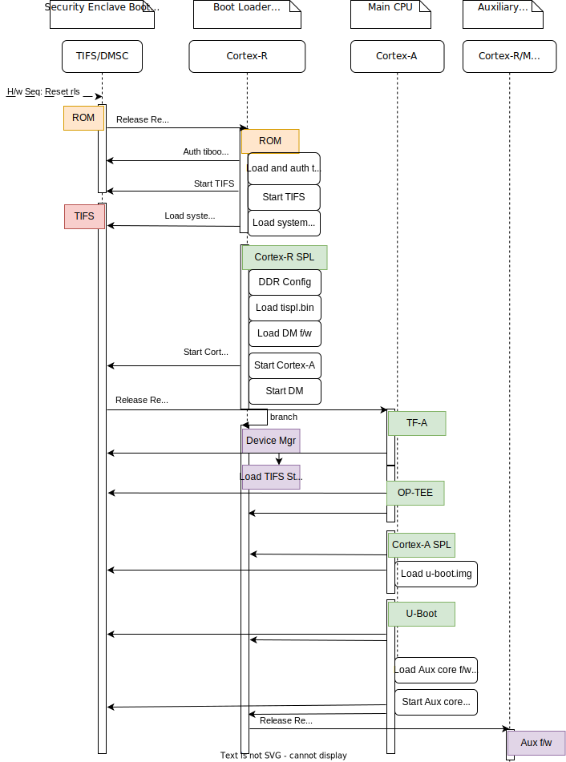

.. SPDX-License-Identifier: GPL-2.0+ OR BSD-3-Clause
.. sectionauthor:: Bryan Brattlof <bb@ti.com>

AM62Px Platforms
================

The AM62Px is an extension of the existing Sitara AM62x low-cost family
of application processors built for Automotive and Linux Application
development. Scalable Arm Cortex-A53 performance and embedded features,
such as: multi high-definition display support, 3D-graphics
acceleration, 4K video acceleration, and extensive peripherals make the
AM62Px well-suited for a broad range of automation and industrial
application, including automotive digital instrumentation, automotive
displays, industrial HMI, and more.

Some highlights of AM62P SoC are:

* Quad-Cortex-A53s (running up to 1.4GHz) in a single cluster.
  Dual/Single core variants are provided in the same package to allow HW
  compatible designs.

* One Device manager Cortex-R5F for system power and resource
  management, and one Cortex-R5F for Functional Safety or
  general-purpose usage.

* One 3D GPU up to 50 GLFOPS

* H.264/H.265 Video Encode/Decode.

* Display support: 3x display support over OLDI/LVDS (1x OLDI-DL, 1x or
  2x OLDI-SL), DSI, or DPI. Up to 3840x1080 @ 60fps resolution

* Integrated Giga-bit Ethernet switch supporting up to a total of two
  external ports (TSN capable).

* 9xUARTs, 5xSPI, 6xI2C, 2xUSB2, 3xCAN-FD, 3xMMC and SD, GPMC for
  NAND/FPGA connection, OSPI memory controller, 3xMcASP for audio,
  1xCSI-RX-4L for Camera, eCAP/eQEP, ePWM, among other peripherals.

* Dedicated Centralized Hardware Security Module with support for secure
  boot, debug security and crypto acceleration and trusted execution
  environment.

* One 32-bit DDR Subsystem that supports LPDDR4, DDR4 memory types.

* Multiple low power modes support, ex: Deep sleep, Standby, MCU-only,
  enabling battery powered system design.

For those interested, more details about this SoC can be found in the
Technical Reference Manual here: https://www.ti.com/lit/pdf/spruj83

Boot Flow:
----------

The bootflow is exactly the same as all SoCs in the am62xxx extended SoC
family. Below is the pictorial representation:

- Here TIFS acts as master and provides all the critical services. R5/A53
  requests TIFS to get these services done as shown in the above diagram.

Sources:
--------

.. include::  ../ti/k3.rst
    :start-after: .. k3_rst_include_start_boot_sources
    :end-before: .. k3_rst_include_end_boot_sources

.. include::  ../ti/k3.rst
    :start-after: .. k3_rst_include_start_boot_firmwares
    :end-before: .. k3_rst_include_end_tifsstub

Build procedure:
----------------

0. Setup the environment variables:

.. include::  ../ti/k3.rst
    :start-after: .. k3_rst_include_start_common_env_vars_desc
    :end-before: .. k3_rst_include_end_common_env_vars_desc

.. include::  ../ti/k3.rst
    :start-after: .. k3_rst_include_start_board_env_vars_desc
    :end-before: .. k3_rst_include_end_board_env_vars_desc

Set the variables corresponding to this platform:

.. include::  ../ti/k3.rst
    :start-after: .. k3_rst_include_start_common_env_vars_defn
    :end-before: .. k3_rst_include_end_common_env_vars_defn

.. prompt:: bash

   export UBOOT_CFG_CORTEXR=am62px_evm_r5_defconfig
   export UBOOT_CFG_CORTEXA=am62px_evm_a53_defconfig
   export TFA_BOARD=lite
   # we dont use any extra TFA parameters
   unset TFA_EXTRA_ARGS
   export OPTEE_PLATFORM=k3-am62x
   export OPTEE_EXTRA_ARGS="CFG_WITH_SOFTWARE_PRNG=y"

.. am62px_evm_rst_include_start_build_steps

1. Trusted Firmware-A:

.. include::  ../ti/k3.rst
    :start-after: .. k3_rst_include_start_build_steps_tfa
    :end-before: .. k3_rst_include_end_build_steps_tfa

2. OP-TEE:

.. include::  ../ti/k3.rst
    :start-after: .. k3_rst_include_start_build_steps_optee
    :end-before: .. k3_rst_include_end_build_steps_optee

3. U-Boot:

* 3.1 R5:

.. include::  ../ti/k3.rst
    :start-after: .. k3_rst_include_start_build_steps_spl_r5
    :end-before: .. k3_rst_include_end_build_steps_spl_r5

* 3.2 A53:

.. include::  ../ti/k3.rst
    :start-after: .. k3_rst_include_start_build_steps_uboot
    :end-before: .. k3_rst_include_end_build_steps_uboot
.. am62px_evm_rst_include_end_build_steps

Target Images
--------------

In order to boot we need tiboot3.bin, tispl.bin and u-boot.img.  Each SoC
variant (HS-FS, HS-SE) requires a different source for these files.

 - HS-FS

        * tiboot3-am62px-hs-fs-evm.bin from step 3.1
        * tispl.bin, u-boot.img from step 3.2

 - HS-SE

        * tiboot3-am62px-hs-evm.bin from step 3.1
        * tispl.bin, u-boot.img from step 3.2

Image formats:
--------------

- tiboot3.bin

.. image:: img/multi_cert_tiboot3.bin.svg
  :alt: tiboot3.bin image format

- tispl.bin

.. image:: img/tifsstub_dm_tispl.bin.svg
  :alt: tispl.bin image format

OSPI:
-----
ROM supports booting from OSPI from offset 0x0.

Flashing images to OSPI:

Below commands can be used to download tiboot3.bin, tispl.bin, and u-boot.img,
over tftp and then flash those to OSPI at their respective addresses.

.. prompt:: bash =>

  sf probe
  tftp ${loadaddr} tiboot3.bin
  sf update $loadaddr 0x0 $filesize
  tftp ${loadaddr} tispl.bin
  sf update $loadaddr 0x80000 $filesize
  tftp ${loadaddr} u-boot.img
  sf update $loadaddr 0x280000 $filesize

Flash layout for OSPI:

A53 SPL DDR Memory Layout
-------------------------

.. am62px_evm_rst_include_start_ddr_mem_layout

This provides an overview memory usage in A53 SPL stage.

.. list-table::
   :widths: 16 16 16
   :header-rows: 1

   * - Region
     - Start Address
     - End Address

   * - EMPTY
     - 0x80000000
     - 0x80080000

   * - TEXT BASE
     - 0x80080000
     - 0x800d8000

   * - EMPTY
     - 0x800d8000
     - 0x80200000

   * - BMP IMAGE
     - 0x80200000
     - 0x80b77660

   * - STACK
     - 0x80b77660
     - 0x80b77e60

   * - GD
     - 0x80b77e60
     - 0x80b78000

   * - MALLOC
     - 0x80b78000
     - 0x80b80000

   * - EMPTY
     - 0x80b80000
     - 0x80c80000

   * - BSS
     - 0x80c80000
     - 0x80d00000

   * - BLOBS
     - 0x80d00000
     - 0x80d00400

   * - EMPTY
     - 0x80d00400
     - 0x81000000
.. am62px_evm_rst_include_end_ddr_mem_layout

Switch Setting for Boot Mode
----------------------------

Boot Mode pins provide means to select the boot mode and options before the
device is powered up. After every POR, they are the main source to populate
the Boot Parameter Tables.

The following table shows some common boot modes used on AM62Px
platforms. More details can be found in the Technical Reference Manual:
https://www.ti.com/lit/pdf/spruj83 under the `Boot Mode Pins` section.

.. note::

   This device is very new. Currently only UART boot is available while
   we continue to add support for the other bootmodes.

.. list-table:: Boot Modes
   :widths: 16 16 16
   :header-rows: 1

   * - Switch Label
     - SW2: 12345678
     - SW3: 12345678

   * - SD
     - 01000000
     - 11000010

   * - OSPI
     - 00000000
     - 11001110

   * - EMMC
     - 00000000
     - 11010010

   * - UART
     - 00000000
     - 11011100

   * - USB DFU
     - 00000000
     - 11001010

For SW2 and SW1, the switch state in the "ON" position = 1.

Debugging U-Boot
----------------

See :ref:`Common Debugging environment - OpenOCD<k3_rst_refer_openocd>`: for
detailed setup information.

.. warning::

  **OpenOCD support after**: v0.12.0

  While support for the entire K3 generation including the am62xxx
  extended family was added before v0.12.0, the tcl scripts for the
  am62px have been accepted and will be available in the next release of
  OpenOCD. It may be necessary to build OpenOCD from source depending on
  the version your distribution has packaged.

.. include::  k3.rst
    :start-after: .. k3_rst_include_start_openocd_connect_XDS110
    :end-before: .. k3_rst_include_end_openocd_connect_XDS110

To start OpenOCD and connect to the board

.. prompt:: bash

  openocd -f board/ti_am62pevm.cfg
