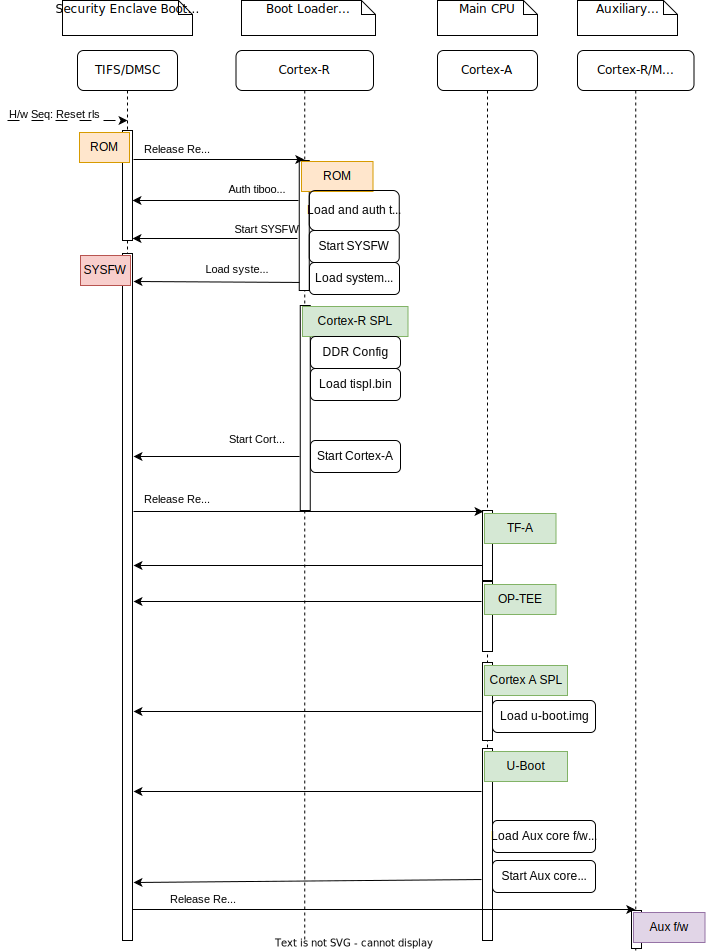

.. SPDX-License-Identifier: GPL-2.0+ OR BSD-3-Clause
.. sectionauthor:: Nishanth Menon <nm@ti.com>

AM64 Platforms
==============

Introduction:
-------------
The AM642 SoC belongs to the K3 Multicore SoC architecture platform,
providing advanced system integration to enable applications such as
Motor Drives, PLC, Remote IO and IoT Gateways.

Some highlights of this SoC are:

* Dual Cortex-A53s in a single cluster, two clusters of dual Cortex-R5F
  MCUs, and a single Cortex-M4F.
* Two Gigabit Industrial Communication Subsystems (ICSSG).
* Integrated Ethernet switch supporting up to a total of two external
  ports.
* PCIe-GEN2x1L, USB3/USB2, 2xCAN-FD, eMMC and SD, UFS, OSPI memory
  controller, QSPI, I2C, eCAP/eQEP, ePWM, ADC, among other
  peripherals.
* Centralized System Controller for Security, Power, and Resource
  Management (DMSC).

More details can be found in the Technical Reference Manual:
 https://www.ti.com/lit/pdf/spruim2

Platform information:

* AM64-EVM: https://www.ti.com/tool/TMDS64EVM
* AM64-SK: https://www.ti.com/tool/SK-AM64B

Boot Flow:
----------
Below is the pictorial representation of boot flow:

- Here TIFS acts as master and provides all the critical services. R5/A53
  requests TIFS to get these services done as shown in the above diagram.

Sources:
--------

.. include::  k3.rst
    :start-after: .. k3_rst_include_start_boot_sources
    :end-before: .. k3_rst_include_end_boot_sources

Build procedure:
----------------
0. Setup the environment variables:

.. include::  k3.rst
    :start-after: .. k3_rst_include_start_common_env_vars_desc
    :end-before: .. k3_rst_include_end_common_env_vars_desc

.. include::  k3.rst
    :start-after: .. k3_rst_include_start_board_env_vars_desc
    :end-before: .. k3_rst_include_end_board_env_vars_desc

Set the variables corresponding to this platform:

.. include::  k3.rst
    :start-after: .. k3_rst_include_start_common_env_vars_defn
    :end-before: .. k3_rst_include_end_common_env_vars_defn
.. prompt:: bash $

  export UBOOT_CFG_CORTEXR=am64x_evm_r5_defconfig
  export UBOOT_CFG_CORTEXA=am64x_evm_a53_defconfig
  export TFA_BOARD=lite
  # we dont use any extra TFA parameters
  unset TFA_EXTRA_ARGS
  export OPTEE_PLATFORM=k3-am64x
  # we dont use any extra TFA parameters
  unset OPTEE_EXTRA_ARGS

.. am64x_evm_rst_include_start_build_steps

1. Trusted Firmware-A:

.. include::  k3.rst
    :start-after: .. k3_rst_include_start_build_steps_tfa
    :end-before: .. k3_rst_include_end_build_steps_tfa

2. OP-TEE:

.. include::  k3.rst
    :start-after: .. k3_rst_include_start_build_steps_optee
    :end-before: .. k3_rst_include_end_build_steps_optee

3. U-Boot:

* 3.1 R5:

.. include::  k3.rst
    :start-after: .. k3_rst_include_start_build_steps_spl_r5
    :end-before: .. k3_rst_include_end_build_steps_spl_r5

* 3.2 A53:

.. include::  k3.rst
    :start-after: .. k3_rst_include_start_build_steps_uboot
    :end-before: .. k3_rst_include_end_build_steps_uboot
.. am64x_evm_rst_include_end_build_steps

Target Images
-------------

In order to boot we need tiboot3.bin, tispl.bin and u-boot.img.  Each SoC
variant (GP, HS-FS, HS-SE) requires a different source for these files.

 - GP

        * tiboot3-am64x-gp-evm.bin from step 3.1
        * tispl.bin_unsigned, u-boot.img_unsigned from step 3.2

 - HS-FS

        * tiboot3-am64x-hs-fs-evm.bin from step 3.1
        * tispl.bin, u-boot.img from step 3.2

 - HS-SE

        * tiboot3-am64x-hs-evm.bin from step 3.1
        * tispl.bin, u-boot.img from step 3.2

Image formats:
--------------

- tiboot3.bin

.. image:: img/multi_cert_tiboot3.bin.svg
  :alt: tiboot3.bin image format

- tispl.bin

.. image:: img/nodm_tispl.bin.svg
  :alt: tispl.bin image format

Switch Setting for Boot Mode
----------------------------

Boot Mode pins provide means to select the boot mode and options before the
device is powered up. After every POR, they are the main source to populate
the Boot Parameter Tables.

The following table shows some common boot modes used on AM64 platform. More
details can be found in the Technical Reference Manual:
https://www.ti.com/lit/pdf/spruim2 under the `Boot Mode Pins` section.

.. list-table:: Boot Modes for AM64x-EVM
   :widths: 16 16 16
   :header-rows: 1

   * - Switch Label
     - SW2: 12345678
     - SW3: 12345678

   * - SD/MMC
     - 11000010
     - 01000000

   * - xSPI/SFDP (OSPI)
     - 11001110
     - 01000000

   * - UART
     - 11011100
     - 00000000

.. note ::

  For SW2 and SW3, the switch state in the "ON" position = 1.

.. list-table:: Boot Modes for AM64x-SK
   :widths: 16 16 16
   :header-rows: 1

   * - Switch Label
     - SW2: 12345678
     - SW3: 12345678

   * - SD/MMC
     - 00000010
     - 01000011

   * - xSPI/SFDP (OSPI)
     - 00000010
     - 01110011

   * - UART
     - 00000000
     - 00111011

.. note ::

  For SW2 and SW3, the switch state in the "ON" position = 1.
  Boot bits on SK is reversed bits to the bootmode signals
