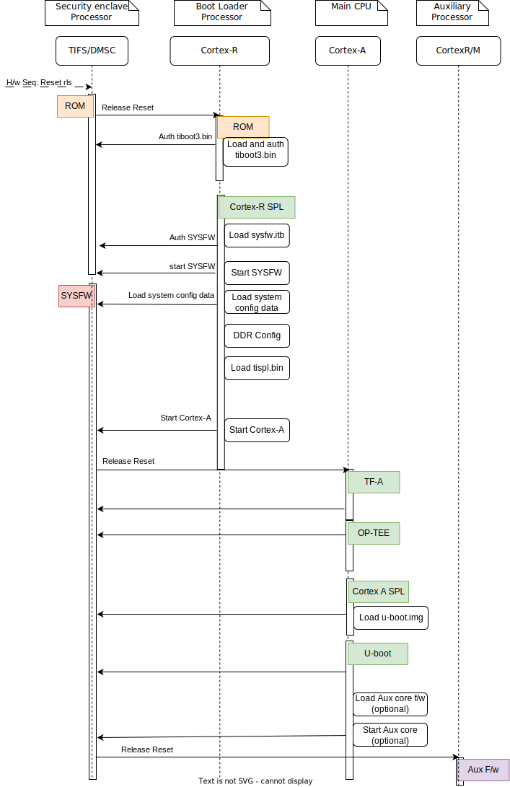
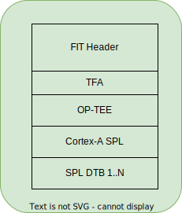
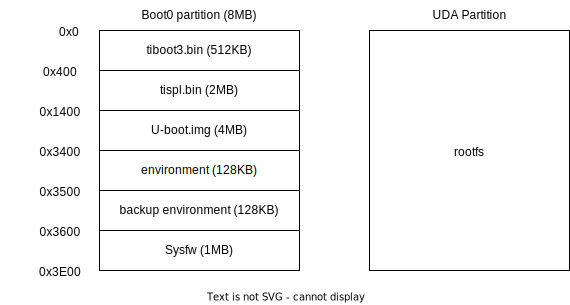

.. SPDX-License-Identifier: GPL-2.0+ OR BSD-3-Clause
.. sectionauthor:: Neha Francis <n-francis@ti.com>

AM65x Platforms
===============

Introduction:
-------------
The AM65x family of SoCs is the first device family from K3 Multicore
SoC architecture, targeted for broad market and industrial control with
aim to meet the complex processing needs of modern embedded products.

The device is built over three domains, each containing specific processing
cores, voltage domains and peripherals:

1. Wake-up (WKUP) domain:
        * Device Management and Security Controller (DMSC)

2. Microcontroller (MCU) domain:
        * Dual Core ARM Cortex-R5F processor

3. MAIN domain:
        * Quad core 64-bit ARM Cortex-A53

More info can be found in TRM: https://www.ti.com/lit/pdf/spruid7

Platform information:

* https://www.ti.com/tool/TMDX654GPEVM

Boot Flow:
----------
On AM65x family devices, ROM supports boot only via MCU(R5). This means that
bootloader has to run on R5 core. In order to meet this constraint, and for
the following reasons the boot flow is designed as mentioned:

1. Need to move away from R5 asap, so that we want to start *any*
firmware on the R5 cores for example autosar can be loaded to receive CAN
response and other safety operations to be started. This operation is
very time critical and is applicable for all automotive use cases.

2. U-Boot on A53 should start other remotecores for various
applications. This should happen before running Linux.

3. In production boot flow, we might not like to use full U-Boot,
instead use Falcon boot flow to reduce boot time.

- Here DMSC acts as master and provides all the critical services. R5/A53
  requests DMSC to get these services done as shown in the above diagram.

Sources:
--------

.. include::  k3.rst
    :start-after: .. k3_rst_include_start_boot_sources
    :end-before: .. k3_rst_include_end_boot_sources

Build procedure:
----------------
0. Setup the environment variables:

.. include::  k3.rst
    :start-after: .. k3_rst_include_start_common_env_vars_desc
    :end-before: .. k3_rst_include_end_common_env_vars_desc

.. include::  k3.rst
    :start-after: .. k3_rst_include_start_board_env_vars_desc
    :end-before: .. k3_rst_include_end_board_env_vars_desc

Set the variables corresponding to this platform:

.. include::  k3.rst
    :start-after: .. k3_rst_include_start_common_env_vars_defn
    :end-before: .. k3_rst_include_end_common_env_vars_defn
.. prompt:: bash $

  export UBOOT_CFG_CORTEXR=am65x_evm_r5_defconfig
  export UBOOT_CFG_CORTEXA=am65x_evm_a53_defconfig
  export TFA_BOARD=generic
  # we dont use any extra TFA parameters
  unset TFA_EXTRA_ARGS
  export OPTEE_PLATFORM=k3-am65x
  # we dont use any extra OP-TEE parameters
  unset OPTEE_EXTRA_ARGS

.. am65x_evm_rst_include_start_build_steps

1. Trusted Firmware-A:

.. include::  k3.rst
    :start-after: .. k3_rst_include_start_build_steps_tfa
    :end-before: .. k3_rst_include_end_build_steps_tfa

2. OP-TEE:

.. include::  k3.rst
    :start-after: .. k3_rst_include_start_build_steps_optee
    :end-before: .. k3_rst_include_end_build_steps_optee

3. U-Boot:

* 3.1 R5:

.. include::  k3.rst
    :start-after: .. k3_rst_include_start_build_steps_spl_r5
    :end-before: .. k3_rst_include_end_build_steps_spl_r5

* 3.2 A53:

.. include::  k3.rst
    :start-after: .. k3_rst_include_start_build_steps_uboot
    :end-before: .. k3_rst_include_end_build_steps_uboot
.. am65x_evm_rst_include_end_build_steps

Target Images
-------------

In order to boot we need tiboot3.bin, sysfw.itb, tispl.bin and u-boot.img.
Each SoC variant (GP and HS) requires a different source for these files.

- GP

        * tiboot3-am65x_sr2-gp-evm.bin, sysfw-am65x_sr2-gp-evm.itb from step 3.1
        * tispl.bin_unsigned, u-boot.img_unsigned from step 3.2

- HS

        * tiboot3-am65x_sr2-hs-evm.bin, sysfw-am65x_sr2-hs-evm.itb from step 3.1
        * tispl.bin, u-boot.img from step 3.2

Image formats:
--------------

- tiboot3.bin

.. image:: img/no_multi_cert_tiboot3.bin.svg
  :alt: tiboot3.bin image format

- tispl.bin

- sysfw.itb

.. image:: img/sysfw.itb.svg
  :alt: sysfw.itb image format

eMMC:
-----
ROM supports booting from eMMC from boot0 partition offset 0x0

Flashing images to eMMC:

The following commands can be used to download tiboot3.bin, tispl.bin,
u-boot.img, and sysfw.itb from an SD card and write them to the eMMC boot0
partition at respective addresses.

.. prompt:: bash =>

  mmc dev 0 1
  fatload mmc 1 ${loadaddr} tiboot3.bin
  mmc write ${loadaddr} 0x0 0x400
  fatload mmc 1 ${loadaddr} tispl.bin
  mmc write ${loadaddr} 0x400 0x1000
  fatload mmc 1 ${loadaddr} u-boot.img
  mmc write ${loadaddr} 0x1400 0x2000
  fatload mmc 1 ${loadaddr} sysfw.itb
  mmc write ${loadaddr} 0x3600 0x800

To give the ROM access to the boot partition, the following commands must be
used for the first time:

.. prompt:: bash =>

  mmc partconf 0 1 1 1
  mmc bootbus 0 1 0 0

To create a software partition for the rootfs, the following command can be
used:

.. prompt:: bash =>

  gpt write mmc 0 ${partitions}

eMMC layout:

Kernel image and DT are expected to be present in the /boot folder of rootfs.
To boot kernel from eMMC, use the following commands:

.. prompt:: bash =>

  setenv mmcdev 0
  setenv bootpart 0
  boot

OSPI:
-----
ROM supports booting from OSPI from offset 0x0.

Flashing images to OSPI:

Below commands can be used to download tiboot3.bin, tispl.bin, u-boot.img,
and sysfw.itb over tftp and then flash those to OSPI at their respective
addresses.

.. prompt:: bash =>

  sf probe
  tftp ${loadaddr} tiboot3.bin
  sf update $loadaddr 0x0 $filesize
  tftp ${loadaddr} tispl.bin
  sf update $loadaddr 0x80000 $filesize
  tftp ${loadaddr} u-boot.img
  sf update $loadaddr 0x280000 $filesize
  tftp ${loadaddr} sysfw.itb
  sf update $loadaddr 0x6C0000 $filesize

Flash layout for OSPI:

.. image:: img/ospi_sysfw.svg
  :alt: OSPI flash partition layout

Kernel Image and DT are expected to be present in the /boot folder of UBIFS
ospi.rootfs just like in SD card case. U-Boot looks for UBI volume named
"rootfs" for rootfs.

To boot kernel from OSPI, at the U-Boot prompt:

.. prompt:: bash =>

  setenv boot ubi
  boot

UART:
-----
ROM supports booting from MCU_UART0 via X-Modem protocol. The entire UART-based
boot process up to U-Boot (proper) prompt goes through different stages and uses
different UART peripherals as follows:

.. list-table:: ROM UART Boot Responsibilities
   :widths: 16 16 16 16
   :header-rows: 1

   * - Who
     - Loading What
     - Hardware Module
     - Protocol

   * - Boot ROM
     - tiboot3.bin
     - MCU_UART0
     - X-Modem(*)

   * - R5 SPL
     - sysfw.itb
     - MCU_UART0
     - Y-Modem(*)

   * - R5 SPL
     - tispl.bin
     - MAIN_UART0
     - Y-Modem

   * - A53 SPL
     - u-boot.img
     - MAIN_UART0
     - Y-Modem

Note that in addition to X/Y-Modem related protocol timeouts the DMSC
watchdog timeout of 3min (typ.) needs to be observed until System Firmware
is fully loaded (from sysfw.itb) and started.

Example bash script sequence for running on a Linux host PC feeding all boot
artifacts needed to the device:

.. prompt:: bash $

  MCU_DEV=/dev/ttyUSB1
  MAIN_DEV=/dev/ttyUSB0

  stty -F $MCU_DEV 115200 cs8 -cstopb -parenb
  stty -F $MAIN_DEV 115200 cs8 -cstopb -parenb

  sb --xmodem tiboot3.bin > $MCU_DEV < $MCU_DEV
  sb --ymodem sysfw.itb > $MCU_DEV < $MCU_DEV
  sb --ymodem tispl.bin > $MAIN_DEV < $MAIN_DEV
  sleep 1
  sb --xmodem u-boot.img > $MAIN_DEV < $MAIN_DEV

Debugging U-Boot
----------------

See :ref:`Common Debugging environment - OpenOCD<k3_rst_refer_openocd>`: for
detailed setup information.

.. warning::

  **OpenOCD support since**: v0.12.0

  If the default package version of OpenOCD in your development
  environment's distribution needs to be updated, it might be necessary to
  build OpenOCD from the source.

.. include::  k3.rst
    :start-after: .. k3_rst_include_start_openocd_connect_XDS110
    :end-before: .. k3_rst_include_end_openocd_connect_XDS110

To start OpenOCD and connect to the board

.. prompt:: bash $

  openocd -f board/ti_am654evm.cfg
