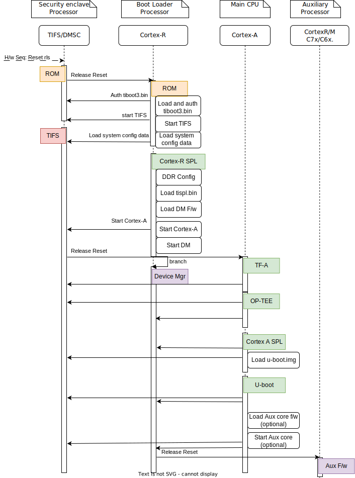
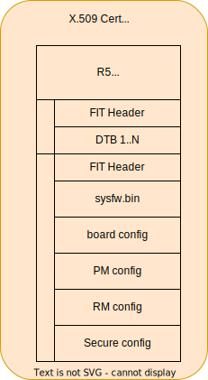

.. SPDX-License-Identifier: GPL-2.0+ OR BSD-3-Clause
.. sectionauthor:: Udit Kumar <u-kumar1@ti.com>

J7200 Platforms
===============

Introduction:
-------------
The J7200 family of SoCs are part of K3 Multicore SoC architecture platform
targeting automotive applications. They are designed as a low power, high
performance and highly integrated device architecture, adding significant
enhancement on processing power, graphics capability, video and imaging
processing, virtualization and coherent memory support.

The device is partitioned into three functional domains, each containing
specific processing cores and peripherals:

1. Wake-up (WKUP) domain:
        * Device Management and Security Controller (DMSC)

2. Microcontroller (MCU) domain:
        * Dual Core ARM Cortex-R5F processor

3. MAIN domain:
        * Dual core 64-bit ARM Cortex-A72

More info can be found in TRM: https://www.ti.com/lit/pdf/spruiu1

Platform information:

* https://www.ti.com/tool/J7200XSOMXEVM

Boot Flow:
----------
Below is the pictorial representation of boot flow:

- Here DMSC acts as master and provides all the critical services. R5/A72
  requests DMSC to get these services done as shown in the above diagram.

Sources:
--------

.. include::  k3.rst
    :start-after: .. k3_rst_include_start_boot_sources
    :end-before: .. k3_rst_include_end_boot_sources

Build procedure:
----------------
0. Setup the environment variables:

.. include::  k3.rst
    :start-after: .. k3_rst_include_start_common_env_vars_desc
    :end-before: .. k3_rst_include_end_common_env_vars_desc

.. include::  k3.rst
    :start-after: .. k3_rst_include_start_board_env_vars_desc
    :end-before: .. k3_rst_include_end_board_env_vars_desc

Set the variables corresponding to this platform:

.. include::  k3.rst
    :start-after: .. k3_rst_include_start_common_env_vars_defn
    :end-before: .. k3_rst_include_end_common_env_vars_defn
.. prompt:: bash $

  export UBOOT_CFG_CORTEXR=j7200_evm_r5_defconfig
  export UBOOT_CFG_CORTEXA=j7200_evm_a72_defconfig
  export TFA_BOARD=generic
  # we dont use any extra TFA parameters
  unset TFA_EXTRA_ARGS
  export OPTEE_PLATFORM=k3-j7200
  # we dont use any extra OP-TEE parameters
  unset OPTEE_EXTRA_ARGS

.. j7200_evm_rst_include_start_build_steps

1. Trusted Firmware-A:

.. include::  k3.rst
    :start-after: .. k3_rst_include_start_build_steps_tfa
    :end-before: .. k3_rst_include_end_build_steps_tfa

2. OP-TEE:

.. include::  k3.rst
    :start-after: .. k3_rst_include_start_build_steps_optee
    :end-before: .. k3_rst_include_end_build_steps_optee

3. U-Boot:

* 3.1 R5:

.. include::  k3.rst
    :start-after: .. k3_rst_include_start_build_steps_spl_r5
    :end-before: .. k3_rst_include_end_build_steps_spl_r5

* 3.2 A72:

.. include::  k3.rst
    :start-after: .. k3_rst_include_start_build_steps_uboot
    :end-before: .. k3_rst_include_end_build_steps_uboot
.. j7200_evm_rst_include_end_build_steps

Target Images
-------------

In order to boot we need tiboot3.bin, tispl.bin and u-boot.img. Each SoC
variant (GP, HS-FS, HS-SE) requires a different source for these files.

 - GP

        * tiboot3-j7200-gp-evm.bin from step 3.1
        * tispl.bin_unsigned, u-boot.img_unsigned from step 3.2

 - HS-FS

        * tiboot3-j7200_sr2-hs-fs-evm.bin from step 3.1
        * tispl.bin, u-boot.img from step 3.2

 - HS-SE

        * tiboot3-j7200_sr2-hs-evm.bin from step 3.1
        * tispl.bin, u-boot.img from step 3.2

Image formats:
--------------

- tiboot3.bin

- tispl.bin

.. image:: img/dm_tispl.bin.svg
  :alt: tispl.bin image format

Switch Setting for Boot Mode
----------------------------

Boot Mode pins provide means to select the boot mode and options before the
device is powered up. After every POR, they are the main source to populate
the Boot Parameter Tables.

The following table shows some common boot modes used on J7200 platform. More
details can be found in the Technical Reference Manual:
https://www.ti.com/lit/pdf/spruiu1 under the `Boot Mode Pins` section.

.. list-table:: Boot Modes
   :widths: 16 16 16
   :header-rows: 1

   * - Switch Label
     - SW9: 12345678
     - SW8: 12345678

   * - SD
     - 00000000
     - 10000010

   * - EMMC
     - 01000000
     - 10000000

   * - OSPI
     - 01000000
     - 00000110

   * - UART
     - 01110000
     - 00000000

   * - USB DFU
     - 00100000
     - 10000000

For SW8 and SW9, the switch state in the "ON" position = 1.

eMMC:
-----
ROM supports booting from eMMC raw read or UDA FS mode.

Below is memory layout in case of booting from
boot 0/1  partition in raw mode.

Current allocated size for tiboot3 size is 1MB, tispl is 2MB.

Size of u-boot.img is taken 4MB for refernece,
But this is subject to change depending upon atf, optee size

In case of UDA FS mode booting, following is layout.

All boot images tiboot3.bin, tispl and u-boot should be written to
fat formatted UDA FS as file.

In case of booting from eMMC, write above images into raw or UDA FS.
and set mmc partconf accordingly.

Debugging U-Boot
----------------

See :ref:`Common Debugging environment - OpenOCD<k3_rst_refer_openocd>`: for
detailed setup information.

.. warning::

  **OpenOCD support since**: v0.12.0

  If the default package version of OpenOCD in your development
  environment's distribution needs to be updated, it might be necessary to
  build OpenOCD from the source.

.. include::  k3.rst
    :start-after: .. k3_rst_include_start_openocd_connect_XDS110
    :end-before: .. k3_rst_include_end_openocd_connect_XDS110

To start OpenOCD and connect to the board

.. prompt:: bash $

  openocd -f board/ti_j7200evm.cfg
