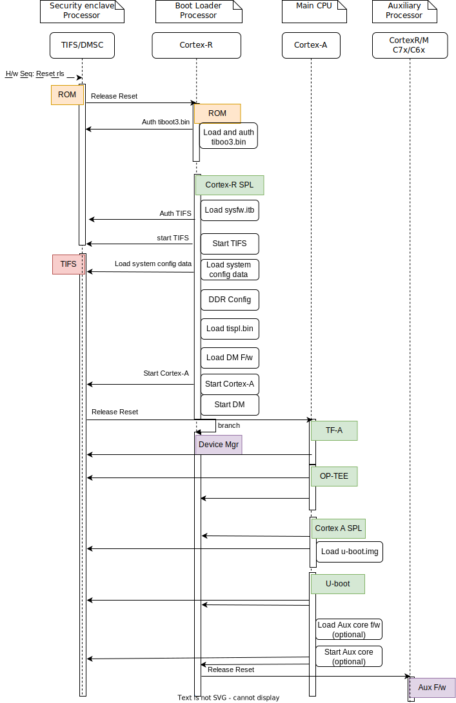
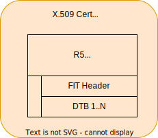
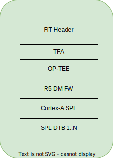
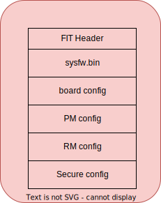
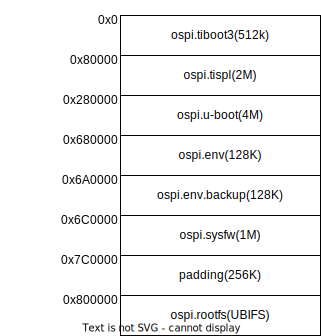

.. SPDX-License-Identifier: GPL-2.0+ OR BSD-3-Clause
.. sectionauthor:: Lokesh Vutla <lokeshvutla@ti.com>

J721E Platforms
===============

Introduction:
-------------
The J721e family of SoCs are part of K3 Multicore SoC architecture platform
targeting automotive applications. They are designed as a low power, high
performance and highly integrated device architecture, adding significant
enhancement on processing power, graphics capability, video and imaging
processing, virtualization and coherent memory support.

The device is partitioned into three functional domains, each containing
specific processing cores and peripherals:

1. Wake-up (WKUP) domain:
        * Device Management and Security Controller (DMSC)

2. Microcontroller (MCU) domain:
        * Dual Core ARM Cortex-R5F processor

3. MAIN domain:
        * Dual core 64-bit ARM Cortex-A72
        * 2 x Dual cortex ARM Cortex-R5 subsystem
        * 2 x C66x Digital signal processor sub system
        * C71x Digital signal processor sub-system with MMA.

More info can be found in TRM: https://www.ti.com/lit/pdf/spruil1

Platform information:

* https://www.ti.com/tool/J721EXSOMXEVM
* https://www.ti.com/tool/SK-TDA4VM

Boot Flow:
----------
Boot flow is similar to that of AM65x SoC and extending it with remoteproc
support. Below is the pictorial representation of boot flow:

- Here DMSC acts as master and provides all the critical services. R5/A72
  requests DMSC to get these services done as shown in the above diagram.

Sources:
--------

.. include::  ../ti/k3.rst
    :start-after: .. k3_rst_include_start_boot_sources
    :end-before: .. k3_rst_include_end_boot_sources

.. include::  ../ti/k3.rst
    :start-after: .. k3_rst_include_start_boot_firmwares
    :end-before: .. k3_rst_include_end_boot_firmwares

Build procedure:
----------------
0. Setup the environment variables:

.. include::  ../ti/k3.rst
    :start-after: .. k3_rst_include_start_common_env_vars_desc
    :end-before: .. k3_rst_include_end_common_env_vars_desc

.. include::  ../ti/k3.rst
    :start-after: .. k3_rst_include_start_board_env_vars_desc
    :end-before: .. k3_rst_include_end_board_env_vars_desc

Set the variables corresponding to this platform:

.. include::  ../ti/k3.rst
    :start-after: .. k3_rst_include_start_common_env_vars_defn
    :end-before: .. k3_rst_include_end_common_env_vars_defn
.. prompt:: bash $

 export UBOOT_CFG_CORTEXR=j721e_evm_r5_defconfig
 export UBOOT_CFG_CORTEXA=j721e_evm_a72_defconfig
 export TFA_BOARD=generic
 # we dont use any extra TFA parameters
 unset TFA_EXTRA_ARGS
 export OPTEE_PLATFORM=k3-j721e
 # we dont use any extra OP-TEE parameters
 unset OPTEE_EXTRA_ARGS

.. j721e_evm_rst_include_start_build_steps

1. Trusted Firmware-A:

.. include::  ../ti/k3.rst
    :start-after: .. k3_rst_include_start_build_steps_tfa
    :end-before: .. k3_rst_include_end_build_steps_tfa

2. OP-TEE:

.. include::  ../ti/k3.rst
    :start-after: .. k3_rst_include_start_build_steps_optee
    :end-before: .. k3_rst_include_end_build_steps_optee

3. U-Boot:

* 3.1 R5:

.. include::  ../ti/k3.rst
    :start-after: .. k3_rst_include_start_build_steps_spl_r5
    :end-before: .. k3_rst_include_end_build_steps_spl_r5

* 3.2 A72:

.. include::  ../ti/k3.rst
    :start-after: .. k3_rst_include_start_build_steps_uboot
    :end-before: .. k3_rst_include_end_build_steps_uboot
.. j721e_evm_rst_include_end_build_steps

Target Images
-------------

In order to boot we need tiboot3.bin, sysfw.itb, tispl.bin and u-boot.img.
Each SoC variant (GP, HS-FS and HS-SE) requires a different source for these
files.

 - GP

        * tiboot3-j721e-gp-evm.bin, sysfw-j721e-gp-evm.itb from step 3.1
        * tispl.bin_unsigned, u-boot.img_unsigned from step 3.2

 - HS-FS

        * tiboot3-j721e_sr2-hs-fs-evm.bin, sysfw-j721e_sr2-hs-fs-evm.itb from step 3.1
        * tispl.bin, u-boot.img from step 3.2

 - HS-SE

        * tiboot3-j721e_sr2-hs-evm.bin, sysfw-j721e_sr2-hs-evm.itb from step 3.1
        * tispl.bin, u-boot.img from step 3.2

Image formats:
--------------

- tiboot3.bin

- tispl.bin

- sysfw.itb

OSPI:
-----
ROM supports booting from OSPI from offset 0x0.

Flashing images to OSPI:

Below commands can be used to download tiboot3.bin, tispl.bin, u-boot.img,
and sysfw.itb over tftp and then flash those to OSPI at their respective
addresses.

.. prompt:: bash =>

  sf probe
  tftp ${loadaddr} tiboot3.bin
  sf update $loadaddr 0x0 $filesize
  tftp ${loadaddr} tispl.bin
  sf update $loadaddr 0x80000 $filesize
  tftp ${loadaddr} u-boot.img
  sf update $loadaddr 0x280000 $filesize
  tftp ${loadaddr} sysfw.itb
  sf update $loadaddr 0x6C0000 $filesize

Flash layout for OSPI:

R5 Memory Map:
--------------

.. list-table::
   :widths: 16 16 16
   :header-rows: 1

   * - Region
     - Start Address
     - End Address

   * - SPL
     - 0x41c00000
     - 0x41c40000

   * - EMPTY
     - 0x41c40000
     - 0x41c81920

   * - STACK
     - 0x41c85920
     - 0x41c81920

   * - Global data
     - 0x41c859f0
     - 0x41c85920

   * - Heap
     - 0x41c859f0
     - 0x41cf59f0

   * - BSS
     - 0x41cf59f0
     - 0x41cff9f0

   * - MCU Scratchpad
     - 0x41cff9fc
     - 0x41cffbfc

   * - ROM DATA
     - 0x41cffbfc
     - 0x41cfffff

Firmware:
---------

The J721e u-boot allows firmware to be loaded for the Cortex-R5 subsystem.
The CPSW5G in J7200 and CPSW9G in J721E present in MAIN domain is configured
and controlled by the ethernet firmware that executes in the MAIN Cortex R5.
The default supported environment variables support loading these firmwares
from only MMC. "dorprocboot" env variable has to be set for the U-BOOT to load
and start the remote cores in the system.

J721E common processor board can be attached to a Ethernet QSGMII card and the
PHY in the card has to be reset before it can be used for data transfer.
"do_main_cpsw0_qsgmii_phyinit" env variable has to be set for the U-BOOT to
configure this PHY.

Debugging U-Boot
----------------

See :ref:`Common Debugging environment - OpenOCD<k3_rst_refer_openocd>`: for
detailed setup information.

.. warning::

  **OpenOCD support since**: v0.12.0

  If the default package version of OpenOCD in your development
  environment's distribution needs to be updated, it might be necessary to
  build OpenOCD from the source.

.. include::  ../ti/k3.rst
    :start-after: .. k3_rst_include_start_openocd_connect_XDS110
    :end-before: .. k3_rst_include_end_openocd_connect_XDS110

To start OpenOCD and connect to the board

.. prompt:: bash $

  openocd -f board/ti_j721eevm.cfg
