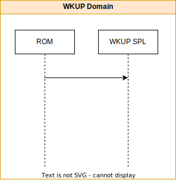
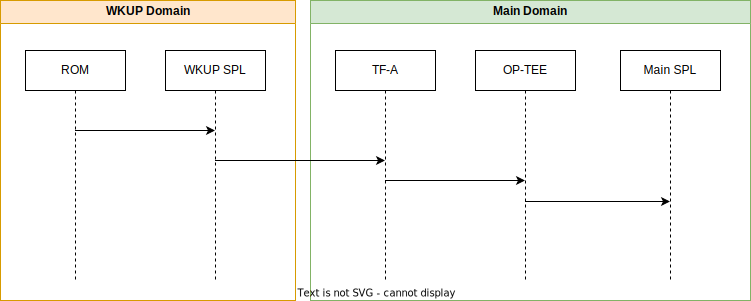
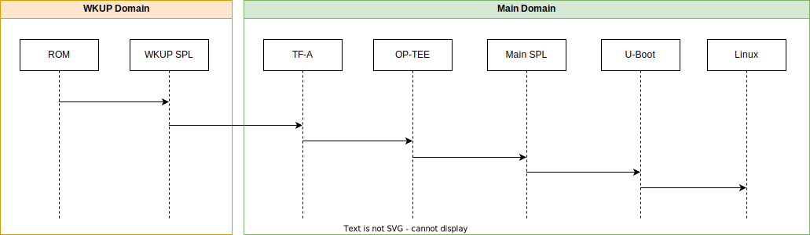
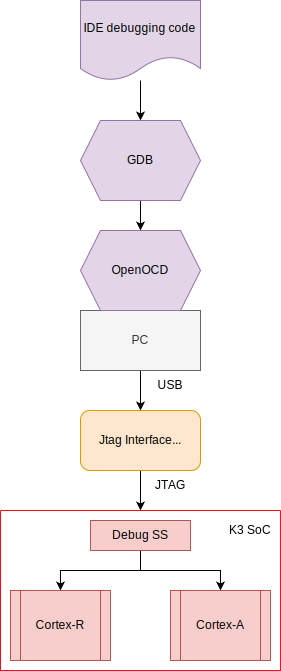

.. SPDX-License-Identifier: GPL-2.0+ OR BSD-3-Clause
.. sectionauthor:: Bryan Brattlof <bb@ti.com>

K3 Generation
=============

Summary
-------

Texas Instrument's K3 family of SoCs utilize a heterogeneous multicore
and highly integrated device architecture targeted to maximize
performance and power efficiency for a wide range of industrial,
automotive and other broad market segments.

Typically the processing cores and the peripherals for these devices are
partitioned into three functional domains to provide ultra-low power
modes as well as accommodating application and industrial safety systems
on the same SoC.  These functional domains are typically called the:

* Wakeup (WKUP) domain
* Micro-controller (MCU) domain
* Main domain

For a more detailed view of what peripherals are attached to each
domain, consult the device specific documentation.

K3 Based SoCs
-------------

.. toctree::
   :maxdepth: 1

   am62x_beagleplay
   am62x_sk
   ../toradex/verdin-am62
   am64x_evm
   am65x_evm
   j7200_evm
   j721e_evm
   j721s2_evm

Boot Flow Overview
------------------

For all K3 SoCs the first core started will be inside the Security
Management Subsystem (SMS) which will secure the device and start a core
in the wakeup domain to run the ROM code. ROM will then initialize the
boot media needed to load the binaries packaged inside `tiboot3.bin`,
including a 32bit U-Boot SPL, (called the wakup SPL) that ROM will jump
to after it has finished loading everything into internal SRAM.

The wakeup SPL, running on a wakeup domain core, will initialize DDR and
any peripherals needed load the larger binaries inside the `tispl.bin`
into DDR.  Once loaded the wakeup SPL will start one of the 'big'
application cores inside the main domain to initialize the main domain,
starting with Trusted Firmware-A (TF-A), before moving on to start
OP-TEE and the main domain's U-Boot SPL.

The main domain's SPL, running on a 64bit application core, has
virtually unlimited space (billions of bytes now that DDR is working) to
initialize even more peripherals needed to load in the `u-boot.img`
which loads more firmware into the micro-controller & wakeup domains and
finally prepare the main domain to run Linux.

This is the typical boot flow for all K3 based SoCs, however this flow
offers quite a lot in the terms of flexibility, especially on High
Security (HS) SoCs.

Boot Flow Variations
^^^^^^^^^^^^^^^^^^^^

All K3 SoCs will generally use the above boot flow with two main
differences depending on the capabilities of the boot ROM and the number
of cores inside the device. These differences split the bootflow into
essentially 4 unique but very similar flows:

* Split binary with a combined firmware: (eg: AM65)
* Combined binary with a combined firmware: (eg: AM64)
* Split binary with a split firmware: (eg: J721E)
* Combined binary with a split firmware: (eg: AM62)

For devices that utilize the split binary approach, ROM is not capable
of loading the firmware into the SoC requiring the wakeup domain's
U-Boot SPL to load the firmware.

Devices with a split firmware will have two firmwares loaded into the
device at different times during the bootup process. TI's Foundational
Security (TIFS), needed to operate the Security Management Subsystem,
will either be loaded by ROM or the WKUP U-Boot SPL, then once the
wakeup U-Boot SPL has completed, the second Device Management (DM)
firmware can be loaded on the now free core in the wakeup domain.

For more information on the bootup process of your SoC, consult the
device specific boot flow documentation.

Software Sources
----------------

All scripts and code needed to build the `tiboot3.bin`, `tispl.bin` and
`u-boot.img` for all K3 SoCs can be located at the following places
online

.. k3_rst_include_start_boot_sources

* **Das U-Boot**

  | **source:** https://source.denx.de/u-boot/u-boot.git
  | **branch:** master

* **Trusted Firmware-A (TF-A)**

  | **source:** https://git.trustedfirmware.org/TF-A/trusted-firmware-a.git/
  | **branch:** master

* **Open Portable Trusted Execution Environment (OP-TEE)**

  | **source:** https://github.com/OP-TEE/optee_os.git
  | **branch:** master

* **TI Firmware (TIFS, DM, SYSFW)**

  | **source:** https://git.ti.com/git/processor-firmware/ti-linux-firmware.git
  | **branch:** ti-linux-firmware

.. note::

  The TI Firmware required for functionality of the system can be
  one of the following combination (see platform specific boot diagram for
  further information as to which component runs on which processor):

  * **TIFS** - TI Foundational Security Firmware - Consists of purely firmware
    meant to run on the security enclave.
  * **DM** - Device Management firmware also called TI System Control Interface
    server (TISCI Server) - This component purely plays the role of managing
    device resources such as power, clock, interrupts, dma etc. This firmware
    runs on a dedicated or multi-use microcontroller outside the security
    enclave.

 OR

  * **SYSFW** - System firmware - consists of both TIFS and DM both running on
    the security enclave.

.. k3_rst_include_end_boot_sources

Build Procedure
---------------

Depending on the specifics of your device, you will need three or more
binaries to boot your SoC.

* `tiboot3.bin` (bootloader for the wakeup domain)
* `tispl.bin` (bootloader for the main domain)
* `u-boot.img`

During the bootup process, both the 32bit wakeup domain and the 64bit
main domains will be involved. This means everything inside the
`tiboot3.bin` running in the wakeup domain will need to be compiled for
32bit cores and most binaries in the `tispl.bin` will need to be
compiled for 64bit main domain CPU cores.

All of that to say you will need both a 32bit and 64bit cross compiler
(assuming you're using an x86 desktop)

.. k3_rst_include_start_common_env_vars_desc
.. list-table:: Generic environment variables
   :widths: 25 25 50
   :header-rows: 1

   * - S/w Component
     - Env Variable
     - Description
   * - All Software
     - CC32
     - Cross compiler for ARMv7 (ARM 32bit), typically arm-linux-gnueabihf-
   * - All Software
     - CC64
     - Cross compiler for ARMv8 (ARM 64bit), typically aarch64-linux-gnu-
   * - All Software
     - LNX_FW_PATH
     - Path to TI Linux firmware repository
   * - All Software
     - TFA_PATH
     - Path to source of Trusted Firmware-A
   * - All Software
     - OPTEE_PATH
     - Path to source of OP-TEE
.. k3_rst_include_end_common_env_vars_desc

.. k3_rst_include_start_common_env_vars_defn
.. prompt:: bash $

 export CC32=arm-linux-gnueabihf-
 export CC64=aarch64-linux-gnu-
 export LNX_FW_PATH=path/to/ti-linux-firmware
 export TFA_PATH=path/to/trusted-firmware-a
 export OPTEE_PATH=path/to/optee_os
.. k3_rst_include_end_common_env_vars_defn

We will also need some common environment variables set up for the various
other build sources. we shall use the following, in the build descriptions below:

.. k3_rst_include_start_board_env_vars_desc
.. list-table:: Board specific environment variables
   :widths: 25 25 50
   :header-rows: 1

   * - S/w Component
     - Env Variable
     - Description
   * - U-Boot
     - UBOOT_CFG_CORTEXR
     - Defconfig for Cortex-R (Boot processor).
   * - U-Boot
     - UBOOT_CFG_CORTEXA
     - Defconfig for Cortex-A (MPU processor).
   * - Trusted Firmware-A
     - TFA_BOARD
     - Platform name used for building TF-A for Cortex-A Processor.
   * - Trusted Firmware-A
     - TFA_EXTRA_ARGS
     - Any extra arguments used for building TF-A.
   * - OP-TEE
     - OPTEE_PLATFORM
     - Platform name used for building OP-TEE for Cortex-A Processor.
   * - OP-TEE
     - OPTEE_EXTRA_ARGS
     - Any extra arguments used for building OP-TEE.
.. k3_rst_include_end_board_env_vars_desc

Building tiboot3.bin
^^^^^^^^^^^^^^^^^^^^

1. To generate the U-Boot SPL for the wakeup domain, use the following
   commands, substituting :code:`{SOC}` for the name of your device (eg:
   am62x) to package the various firmware and the wakeup UBoot SPL into
   the final `tiboot3.bin` binary. (or the `sysfw.itb` if your device
   uses the split binary flow)

.. k3_rst_include_start_build_steps_spl_r5
.. prompt:: bash $

 # inside u-boot source
 make $UBOOT_CFG_CORTEXR
 make CROSS_COMPILE=$CC32 BINMAN_INDIRS=$LNX_FW_PATH
.. k3_rst_include_end_build_steps_spl_r5

At this point you should have all the needed binaries to boot the wakeup
domain of your K3 SoC.

**Combined Binary Boot Flow** (eg: am62x, am64x, ... )

   `tiboot3-{SOC}-{gp/hs-fs/hs}.bin`

**Split Binary Boot Flow** (eg: j721e, am65x)

   | `tiboot3-{SOC}-{gp/hs-fs/hs}.bin`
   | `sysfw-{SOC}-{gp/hs-fs/hs}-evm.itb`

.. note ::

   It's important to rename the generated `tiboot3.bin` and `sysfw.itb`
   to match exactly `tiboot3.bin` and `sysfw.itb` as ROM and the wakeup
   UBoot SPL will only look for and load the files with these names.

Building tispl.bin
^^^^^^^^^^^^^^^^^^

The `tispl.bin` is a standard fitImage combining the firmware need for
the main domain to function properly as well as Device Management (DM)
firmware if your device using a split firmware.

2. We will first need TF-A, as it's the first thing to run on the 'big'
   application cores on the main domain.

.. k3_rst_include_start_build_steps_tfa
.. prompt:: bash $

 # inside trusted-firmware-a source
 make CROSS_COMPILE=$CC64 ARCH=aarch64 PLAT=k3 SPD=opteed $TFA_EXTRA_ARGS \
      TARGET_BOARD=$TFA_BOARD
.. k3_rst_include_end_build_steps_tfa

Typically all `j7*` devices will use `TARGET_BOARD=generic` or `TARGET_BOARD
=j784s4` (if it is a J784S4 device), while typical Sitara (`am6*`) devices
use the `lite` option.

3. The Open Portable Trusted Execution Environment (OP-TEE) is designed
   to run as a companion to a non-secure Linux kernel for Cortex-A cores
   using the TrustZone technology built into the core.

.. k3_rst_include_start_build_steps_optee
.. prompt:: bash $

 # inside optee_os source
 make CROSS_COMPILE=$CC32 CROSS_COMPILE64=$CC64 CFG_ARM64_core=y $OPTEE_EXTRA_ARGS \
       PLATFORM=$OPTEE_PLATFORM
.. k3_rst_include_end_build_steps_optee

4. Finally, after TF-A has initialized the main domain and OP-TEE has
   finished, we can jump back into U-Boot again, this time running on a
   64bit core in the main domain.

.. k3_rst_include_start_build_steps_uboot
.. prompt:: bash $

 # inside u-boot source
 make $UBOOT_CFG_CORTEXA
 make CROSS_COMPILE=$CC64 BINMAN_INDIRS=$LNX_FW_PATH \
        BL31=$TFA_PATH/build/k3/$TFA_BOARD/release/bl31.bin \
        TEE=$OPTEE_PATH/out/arm-plat-k3/core/tee-raw.bin
.. k3_rst_include_end_build_steps_uboot

At this point you should have every binary needed initialize both the
wakeup and main domain and to boot to the U-Boot prompt

**Main Domain Bootloader**

   | `tispl.bin` for HS devices or `tispl.bin_unsigned` for GP devices
   | `u-boot.img` for HS devices or `u-boot.img_unsigned` for GP devices

Fit Signature Signing
---------------------

K3 Platforms have fit signature signing enabled by default on their primary
platforms. Here we'll take an example for creating fit image for J721e platform
and the same can be extended to other platforms

1. Describing FIT source

  .. code-block:: bash

    /dts-v1/;

    / {
            description = "Kernel fitImage for j721e-hs-evm";
            #address-cells = <1>;

            images {
                    kernel-1 {
                            description = "Linux kernel";
                            data = /incbin/("Image");
                            type = "kernel";
                            arch = "arm64";
                            os = "linux";
                            compression = "none";
                            load = <0x80080000>;
                            entry = <0x80080000>;
                            hash-1 {
                                    algo = "sha512";
                            };

                    };
                    fdt-ti_k3-j721e-common-proc-board.dtb {
                            description = "Flattened Device Tree blob";
                            data = /incbin/("k3-j721e-common-proc-board.dtb");
                            type = "flat_dt";
                            arch = "arm64";
                            compression = "none";
                            load = <0x83000000>;
                            hash-1 {
                                    algo = "sha512";
                            };

                    };
            };

            configurations {
                    default = "conf-ti_k3-j721e-common-proc-board.dtb";
                    conf-ti_k3-j721e-common-proc-board.dtb {
                            description = "Linux kernel, FDT blob";
                            fdt = "fdt-ti_k3-j721e-common-proc-board.dtb";
                            kernel = "kernel-1";
                            signature-1 {
                                    algo = "sha512,rsa4096";
                                    key-name-hint = "custMpk";
                                    sign-images = "kernel", "fdt";
                            };
                    };
            };
    };

  You would require to change the '/incbin/' lines to point to the respective
  files in your local machine and the key-name-hint also needs to be changed
  if you are using some other key other than the TI dummy key that we are
  using for this example.

2. Compile U-boot for the respective board

.. include::  k3.rst
    :start-after: .. k3_rst_include_start_build_steps_uboot
    :end-before: .. k3_rst_include_end_build_steps_uboot

.. note::

    The changes only affect a72 binaries so the example just builds that

3. Sign the fit image and embed the dtb in uboot

  Now once the build is done, you'll have a dtb for your board that you'll
  be passing to mkimage for signing the fitImage and embedding the key in
  the u-boot dtb.

  .. prompt:: bash $

    mkimage -r -f fitImage.its -k $UBOOT_PATH/board/ti/keys -K
    $UBOOT_PATH/build/a72/dts/dt.dtb

  For signing a secondary platform, pass the -K parameter to that DTB

  .. prompt:: bash $

    mkimage -f fitImage.its -k $UBOOT_PATH/board/ti/keys -K
    $UBOOT_PATH/build/a72/arch/arm/dts/k3-j721e-sk.dtb

  .. note::

    If changing `CONFIG_DEFAULT_DEVICE_TREE` to the secondary platform,
    binman changes would also be required so that correct dtb gets packaged.

    .. code-block:: bash

      diff --git a/arch/arm/dts/k3-j721e-binman.dtsi b/arch/arm/dts/k3-j721e-binman.dtsi
      index 673be646b1e3..752fa805fe8d 100644
      --- a/arch/arm/dts/k3-j721e-binman.dtsi
      +++ b/arch/arm/dts/k3-j721e-binman.dtsi
      @@ -299,8 +299,8 @@
       #define SPL_J721E_SK_DTB "spl/dts/k3-j721e-sk.dtb"

       #define UBOOT_NODTB "u-boot-nodtb.bin"
      -#define J721E_EVM_DTB "u-boot.dtb"
      -#define J721E_SK_DTB "arch/arm/dts/k3-j721e-sk.dtb"
      +#define J721E_EVM_DTB "arch/arm/dts/k3-j721e-common-proc-board.dtb"
      +#define J721E_SK_DTB "u-boot.dtb"

5. Rebuilt u-boot

   This is required so that the modified dtb gets updated in u-boot.img

.. include::  k3.rst
    :start-after: .. k3_rst_include_start_build_steps_uboot
    :end-before: .. k3_rst_include_end_build_steps_uboot

6. (Optional) Enabled FIT_SIGNATURE_ENFORCED

   By default u-boot will boot up the fit image without any authentication as
   such if the public key is not embedded properly, to check if the public key
   nodes are proper you can enable FIT_SIGNATURE_ENFORCED that would not rely
   on the dtb for anything else then the signature node for checking the fit
   image, rest other things will be enforced such as the property of
   required-keys. This is not an extensive check so do manual checks also

   This is by default enabled for devices with TI_SECURE_DEVICE enabled.

.. note::

   The devices now also have distroboot enabled so if the fit image doesn't
   work then the fallback to normal distroboot will be there on hs devices,
   this will need to be explicitly disabled by changing the boot_targets.

Saving environment
------------------

SAVEENV is disabled by default and for the new flow uses Uenv.txt as the default
way for saving the environments. This has been done as Uenv.txt is more granular
then the saveenv command and can be used across various bootmodes too.

**Writing to MMC/EMMC**

.. prompt:: bash =>

  env export -t $loadaddr <list of variables>
  fatwrite mmc ${mmcdev} ${loadaddr} ${bootenvfile} ${filesize}

**Reading from MMC/EMMC**

By default run envboot will read it from the MMC/EMMC partition ( based on
mmcdev) and set the environments.

If manually needs to be done then the environment can be read from the
filesystem and then imported

.. prompt:: bash =>

  fatload mmc ${mmcdev} ${loadaddr} ${bootenvfile}
  env import -t ${loadaddr} ${filesize}

.. _k3_rst_refer_openocd:

Common Debugging environment - OpenOCD
--------------------------------------

This section will show you how to connect a board to `OpenOCD
<https://openocd.org/>`_ and load the SPL symbols for debugging with
a K3 generation device. To follow this guide, you must build custom
u-boot binaries, start your board from a boot media such as an SD
card, and use an OpenOCD environment. This section uses generic
examples, though you can apply these instructions to any supported K3
generation device.

The overall structure of this setup is in the following figure.

.. note::

  If you find these instructions useful, please consider `donating
  <https://openocd.org/pages/donations.html>`_ to OpenOCD.

Step 1: Download and install OpenOCD
^^^^^^^^^^^^^^^^^^^^^^^^^^^^^^^^^^^^

To get started, it is more convenient if the distribution you
use supports OpenOCD by default. Follow the instructions in the
`getting OpenOCD <https://openocd.org/pages/getting-openocd.html>`_
documentation to pick the installation steps appropriate to your
environment. Some references to OpenOCD documentation:

* `OpenOCD User Guide <https://openocd.org/doc/html/index.html>`_
* `OpenOCD Developer's Guide <https://openocd.org/doc/doxygen/html/index.html>`_

Refer to the release notes corresponding to the `OpenOCD version
<https://github.com/openocd-org/openocd/releases>`_ to ensure

* Processor support: In general, processor support shouldn't present
  any difficulties since OpenOCD provides solid support for both ARMv8
  and ARMv7.
* SoC support: When working with System-on-a-Chip (SoC), the support
  usually comes as a TCL config file. It is vital to ensure the correct
  version of OpenOCD or to use the TCL files from the latest release or
  the one mentioned.
* Board or the JTAG adapter support: In most cases, board support is
  a relatively easy problem if the board has a JTAG pin header. All
  you need to do is ensure that the adapter you select is compatible
  with OpenOCD. Some boards come with an onboard JTAG adapter that
  requires a USB cable to be plugged into the board, in which case, it
  is vital to ensure that the JTAG adapter is supported. Fortunately,
  almost all TI K3 SK/EVMs come with TI's XDS110, which has out of the
  box support by OpenOCD. The board-specific documentation will
  cover the details and any adapter/dongle recommendations.

.. prompt:: bash $

 openocd -v

.. note::

 OpenOCD version 0.12.0 is usually required to connect to most K3
 devices. If your device is only supported by a newer version than the
 one provided by your distribution, you may need to build it from the source.

Building OpenOCD from source
""""""""""""""""""""""""""""

The dependency package installation instructions below are for Debian
systems, but equivalent instructions should exist for systems with
other package managers. Please refer to the `OpenOCD Documentation
<https://openocd.org/>`_ for more recent installation steps.

.. prompt:: bash $

  # Check the packages to be installed: needs deb-src in sources.list
  sudo apt build-dep openocd
  # The following list is NOT complete - please check the latest
  sudo apt-get install libtool pkg-config texinfo libusb-dev \
    libusb-1.0.0-dev libftdi-dev libhidapi-dev autoconf automake
  git clone https://github.com/openocd-org/openocd.git openocd
  cd openocd
  git submodule init
  git submodule update
  ./bootstrap
  ./configure --prefix=/usr/local/
  make -j`nproc`
  sudo make install

.. note::

  The example above uses the GitHub mirror site. See
  `git repo information <https://openocd.org/doc/html/Developers.html#OpenOCD-Git-Repository>`_
  information to pick the official git repo.
  If a specific version is desired, select the version using `git checkout tag`.

Installing OpenOCD udev rules
"""""""""""""""""""""""""""""

The step is not necessary if the distribution supports the OpenOCD, but
if building from a source, ensure that the udev rules are installed
correctly to ensure a sane system.

.. prompt:: bash $

  # Go to the OpenOCD source directory
  cd openocd
  Copy the udev rules to the correct system location
  sudo cp ./contrib/60-openocd.rules \
      ./src/jtag/drivers/libjaylink/contrib/99-libjaylink.rules \
      /etc/udev/rules.d/
  # Get Udev to load the new rules up
  sudo udevadm control --reload-rules
  # Use the new rules on existing connected devices
  sudo udevadm trigger

Step 2: Setup GDB
^^^^^^^^^^^^^^^^^

Most systems come with gdb-multiarch package.

.. prompt:: bash $

  # Install gdb-multiarch package
  sudo apt-get install gdb-multiarch

Though using GDB natively is normal, developers with interest in using IDE
may find a few of these interesting:

* `gdb-dashboard <https://github.com/cyrus-and/gdb-dashboard>`_
* `gef <https://github.com/hugsy/gef>`_
* `peda <https://github.com/longld/peda>`_
* `pwndbg <https://github.com/pwndbg/pwndbg>`_
* `voltron <https://github.com/snare/voltron>`_
* `ddd <https://www.gnu.org/software/ddd/>`_
* `vscode <https://www.justinmklam.com/posts/2017/10/vscode-debugger-setup/>`_
* `vim conque-gdb <https://github.com/vim-scripts/Conque-GDB>`_
* `emacs realgud <https://github.com/realgud/realgud/wiki/gdb-notes>`_
* `Lauterbach IDE <https://www2.lauterbach.com/pdf/backend_gdb.pdf>`_

.. warning::
  LLDB support for OpenOCD is still a work in progress as of this writing.
  Using GDB is probably the safest option at this point in time.

Step 3: Connect board to PC
^^^^^^^^^^^^^^^^^^^^^^^^^^^
There are few patterns of boards in the ecosystem

.. k3_rst_include_start_openocd_connect_XDS110

**Integrated JTAG adapter/dongle**: The board has a micro-USB connector labelled
XDS110 USB or JTAG. Connect a USB cable to the board to the mentioned port.

.. note::

  There are multiple USB ports on a typical board, So, ensure you have read
  the user guide for the board and confirmed the silk screen label to ensure
  connecting to the correct port.

.. k3_rst_include_end_openocd_connect_XDS110

.. k3_rst_include_start_openocd_connect_cti20

**cTI20 connector**: The TI's `cTI20
<https://software-dl.ti.com/ccs/esd/documents/xdsdebugprobes/emu_JTAG_connectors.html#cti-20-pin-header-information>`_ connector
is probably the most prevelant on TI platforms. Though many
TI boards have an onboard XDS110, cTI20 connector is usually
provided as an alternate scheme to connect alternatives such
as `Lauterbach <https://www.lauterbach.com/>`_ or `XDS560
<https://www.ti.com/tool/TMDSEMU560V2STM-U>`_.

To debug on these boards, the following combinations is suggested:

* `TUMPA <https://www.diygadget.com/JTAG-cables-and-microcontroller-programmers/tiao-usb-multi-protocol-adapter-JTAG-spi-i2c-serial>`_
  or `equivalent dongles supported by OpenOCD. <https://openocd.org/doc/html/Debug-Adapter-Hardware.html#Debug-Adapter-Hardware>`_
* Cable such as `Tag-connect ribbon cable <https://www.tag-connect.com/product/20-pin-cortex-ribbon-cable-4-length-with-50-mil-connectors>`_
* Adapter to convert cTI20 to ARM20 such as those from
  `Segger <https://www.segger.com/products/debug-probes/j-link/accessories/adapters/ti-cti-20-adapter/>`_
  or `Lauterbach LA-3780 <https://www.lauterbach.com/ad3780.html>`_
  Or optionally, if you have manufacturing capability then you could try
  `BeagleBone JTAG Adapter <https://github.com/mmorawiec/BeagleBone-Black-JTAG-Adapters>`_

.. warning::
  XDS560 and Lauterbach are proprietary solutions and is not supported by
  OpenOCD.
  When purchasing an off the shelf adapter/dongle, you do want to be careful
  about the signalling though. Please
  `read for additional info <https://software-dl.ti.com/ccs/esd/xdsdebugprobes/emu_JTAG_connectors.html>`_.

.. k3_rst_include_end_openocd_connect_cti20

.. k3_rst_include_start_openocd_connect_tag_connect

**Tag-Connect**: `Tag-Connect <https://www.tag-connect.com/>`_
pads on the boards which require special cable. Please check the documentation
to `identify <https://www.tag-connect.com/info/legs-or-no-legs>`_ if "legged"
or "no-leg" version of the cable is appropriate for the board.

To debug on these boards, you will need:

* `TUMPA <https://www.diygadget.com/JTAG-cables-and-microcontroller-programmers/tiao-usb-multi-protocol-adapter-JTAG-spi-i2c-serial>`_
  or `equivalent dongles supported by OpenOCD <https://openocd.org/doc/html/Debug-Adapter-Hardware.html#Debug-Adapter-Hardware>`_.
* Tag-Connect cable appropriate to the board such as
  `TC2050-IDC-NL <https://www.tag-connect.com/product/TC2050-IDC-NL-10-pin-no-legs-cable-with-ribbon-connector>`_
* In case of no-leg, version, a
  `retaining clip <https://www.tag-connect.com/product/tc2050-clip-3pack-retaining-clip>`_
* Tag-Connect to ARM20
  `adapter <https://www.tag-connect.com/product/tc2050-arm2010-arm-20-pin-to-tc2050-adapter>`_

.. note::
  You can optionally use a 3d printed solution such as
  `Protective cap <https://www.thingiverse.com/thing:3025584>`_ or
  `clip <https://www.thingiverse.com/thing:3035278>`_ to replace
  the retaining clip.

.. warning::
  With the Tag-Connect to ARM20 adapter, Please solder the "Trst" signal for
  connection to work.

.. k3_rst_include_end_openocd_connect_tag_connect

Debugging with OpenOCD
^^^^^^^^^^^^^^^^^^^^^^

Debugging U-Boot is different from debugging regular user space
applications. The bootloader initialization process involves many boot
media and hardware configuration operations. For K3 devices, there
are also interactions with security firmware. While reloading the
"elf" file works through GDB, developers must be mindful of cascading
initialization's potential consequences.

Consider the following code change:

.. code-block:: diff

  --- a/file.c	2023-07-29 10:55:29.647928811 -0500
  +++ b/file.c	2023-07-29 10:55:46.091856816 -0500
  @@ -1,3 +1,3 @@
   val = readl(reg);
  -val |= 0x2;
  +val |= 0x1;
   writel(val, reg);

Re-running the elf file with the above change will result in the
register setting 0x3 instead of the intended 0x1. There are other
hardware blocks which may not behave very well with a re-initialization
without proper shutdown.

To help narrow the debug down, it is usually simpler to use the
standard boot media to get to the bootloader and debug only in the area
of interest.

In general, to debug u-boot spl/u-boot with OpenOCD there are three steps:

* Modify the code adding a loop to allow the debugger to attach
  near the point of interest. Boot up normally to stop at the loop.
* Connect with OpenOCD and step out of the loop.
* Step through the code to find the root of issue.

Typical debugging involves a few iterations of the above sequence.
Though most bootloader developers like to use printf to debug,
debug with JTAG tends to be most efficient since it is possible to
investigate the code flow and inspect hardware registers without
repeated iterations.

Code modification
"""""""""""""""""

* **start.S**: Adding an infinite while loop at the very entry of
  U-Boot. For this, look for the corresponding start.S entry file.
  This is usually only required when debugging some core SoC or
  processor related function. For example: arch/arm/cpu/armv8/start.S or
  arch/arm/cpu/armv7/start.S

.. code-block:: diff

  diff --git a/arch/arm/cpu/armv7/start.S b/arch/arm/cpu/armv7/start.S
  index 69e281b086..744929e825 100644
  --- a/arch/arm/cpu/armv7/start.S
  +++ b/arch/arm/cpu/armv7/start.S
  @@ -37,6 +37,8 @@
   #endif

   reset:
  +dead_loop:
  +    b dead_loop
       /* Allow the board to save important registers */
       b    save_boot_params
   save_boot_params_ret:

* **board_init_f**: Adding an infinite while loop at the board entry
  function. In many cases, it is important to debug the boot process if
  any changes are made for board-specific applications. Below is a step
  by step process for debugging the boot SPL or Armv8 SPL:

  To debug the boot process in either domain, we will first
  add a modification to the code we would like to debug.
  In this example, we will debug ``board_init_f`` inside
  ``arch/arm/mach-k3/{soc}_init.c``. Since some sections of U-Boot
  will be executed multiple times during the bootup process of K3
  devices, we will need to include either ``CONFIG_ARM64`` or
  ``CONFIG_CPU_V7R`` to catch the CPU at the desired place during the
  bootup process (Main or Wakeup domains). For example, modify the
  file as follows (depending on need):

.. code-block:: c

  void board_init_f(ulong dummy)
  {
      .
      .
      /* Code to run on the R5F (Wakeup/Boot Domain) */
      if (IS_ENABLED(CONFIG_CPU_V7R)) {
          volatile int x = 1;
          while(x) {};
      }
      ...
      /* Code to run on the ARMV8 (Main Domain) */
      if (IS_ENABLED(CONFIG_ARM64)) {
          volatile int x = 1;
          while(x) {};
      }
      .
      .
  }

Connecting with OpenOCD for a debug session
"""""""""""""""""""""""""""""""""""""""""""

Startup OpenOCD to debug the platform as follows:

* **Integrated JTAG interface**: If the evm has a debugger such as
  XDS110 inbuilt, there is typically an evm board support added and a
  cfg file will be available.

.. k3_rst_include_start_openocd_cfg_XDS110

.. prompt:: bash $

  openocd -f board/{board_of_choice}.cfg

.. k3_rst_include_end_openocd_cfg_XDS110

.. k3_rst_include_start_openocd_cfg_external_intro

* **External JTAG adapter/interface**: In other cases, where an
  adapter/dongle is used, a simple cfg file can be created to integrate the
  SoC and adapter information. See `supported TI K3 SoCs
  <https://github.com/openocd-org/openocd/blob/master/tcl/target/ti_k3.cfg#L59>`_
  to decide if the SoC is supported or not.

.. prompt:: bash $

  openocd -f openocd_connect.cfg

.. k3_rst_include_end_openocd_cfg_external_intro

  For example, with BeaglePlay (AM62X platform), the openocd_connect.cfg:

.. code-block:: tcl

  # TUMPA example:
  # http://www.tiaowiki.com/w/TIAO_USB_Multi_Protocol_Adapter_User's_Manual
  source [find interface/ftdi/tumpa.cfg]

  transport select jtag

  # default JTAG configuration has only SRST and no TRST
  reset_config srst_only srst_push_pull

  # delay after SRST goes inactive
  adapter srst delay 20

  if { ![info exists SOC] } {
    # Set the SoC of interest
    set SOC am625
  }

  source [find target/ti_k3.cfg]

  ftdi tdo_sample_edge falling

  # Speeds for FT2232H are in multiples of 2, and 32MHz is tops
  # max speed we seem to achieve is ~20MHz.. so we pick 16MHz
  adapter speed 16000

Below is an example of the output of this command:

.. code-block:: console

  Info : Listening on port 6666 for tcl connections
  Info : Listening on port 4444 for telnet connections
  Info : XDS110: connected
  Info : XDS110: vid/pid = 0451/bef3
  Info : XDS110: firmware version = 3.0.0.20
  Info : XDS110: hardware version = 0x002f
  Info : XDS110: connected to target via JTAG
  Info : XDS110: TCK set to 2500 kHz
  Info : clock speed 2500 kHz
  Info : JTAG tap: am625.cpu tap/device found: 0x0bb7e02f (mfg: 0x017 (Texas Instruments), part: 0xbb7e, ver: 0x0)
  Info : starting gdb server for am625.cpu.sysctrl on 3333
  Info : Listening on port 3333 for gdb connections
  Info : starting gdb server for am625.cpu.a53.0 on 3334
  Info : Listening on port 3334 for gdb connections
  Info : starting gdb server for am625.cpu.a53.1 on 3335
  Info : Listening on port 3335 for gdb connections
  Info : starting gdb server for am625.cpu.a53.2 on 3336
  Info : Listening on port 3336 for gdb connections
  Info : starting gdb server for am625.cpu.a53.3 on 3337
  Info : Listening on port 3337 for gdb connections
  Info : starting gdb server for am625.cpu.main0_r5.0 on 3338
  Info : Listening on port 3338 for gdb connections
  Info : starting gdb server for am625.cpu.gp_mcu on 3339
  Info : Listening on port 3339 for gdb connections

.. note::
  Notice the default configuration is non-SMP configuration allowing
  for each of the core to be attached and debugged simultaneously.
  ARMv8 SPL/U-Boot starts up on cpu0 of a53/a72.

.. k3_rst_include_start_openocd_cfg_external_gdb

To debug using this server, use GDB directly or your preferred
GDB-based IDE. To start up GDB in the terminal, run the following
command.

.. prompt:: bash $

  gdb-multiarch

To connect to your desired core, run the following command within GDB:

.. prompt:: bash (gdb)

  target extended-remote localhost:{port for desired core}

To load symbols:

.. warning::

  SPL and U-Boot does a re-location of address compared to where it
  is loaded originally. This step takes place after the DDR size is
  determined from dt parsing. So, debugging can be split into either
  "before re-location" or "after re-location". Please refer to the
  file ''doc/README.arm-relocation'' to see how to grab the relocation
  address.

* Prior to relocation:

.. prompt:: bash (gdb)

  symbol-file {path to elf file}

* After relocation:

.. prompt:: bash (gdb)

  # Drop old symbol file
  symbol-file
  # Pick up new relocaddr
  add-symbol-file {path to elf file} {relocaddr}

.. k3_rst_include_end_openocd_cfg_external_gdb

In the above example of AM625,

.. prompt:: bash (gdb)

  target extended-remote localhost:3338     <- R5F (Wakeup Domain)
  target extended-remote localhost:3334     <- A53 (Main Domain)

The core can now be debugged directly within GDB using GDB commands or
if using IDE, as appropriate to the IDE.

Stepping through the code
"""""""""""""""""""""""""

`GDB TUI Commands
<https://sourceware.org/gdb/onlinedocs/gdb/TUI-Commands.html>`_ can
help set up the display more sensible for debug. Provide the name
of the layout that can be used to debug. For example, use the GDB
command ``layout src`` after loading the symbols to see the code and
breakpoints. To exit the debug loop added above, add any breakpoints
needed and run the following GDB commands to step out of the debug
loop set in the ``board_init_f`` function.

.. prompt:: bash (gdb)

  set x = 0
  continue

The platform has now been successfully setup to debug with OpenOCD
using GDB commands or a GDB-based IDE. See `OpenOCD documentation for
GDB <https://openocd.org/doc/html/GDB-and-OpenOCD.html>`_ for further
information.

.. warning::

  On the K3 family of devices, a watchdog timer within the DMSC is
  enabled by default by the ROM bootcode with a timeout of 3 minutes.
  The watchdog timer is serviced by System Firmware (SYSFW) or TI
  Foundational Security (TIFS) during normal operation. If debugging
  the SPL before the SYSFW is loaded, the watchdog timer will not get
  serviced automatically and the debug session will reset after 3
  minutes. It is recommended to start debugging SPL code only after
  the startup of SYSFW to avoid running into the watchdog timer reset.

Miscellaneous notes with OpenOCD
^^^^^^^^^^^^^^^^^^^^^^^^^^^^^^^^

Currently, OpenOCD does not support tracing for K3 platforms. Tracing
function could be beneficial if the bug in code occurs deep within
nested function and can optionally save developers major trouble of
stepping through a large quantity of code.
