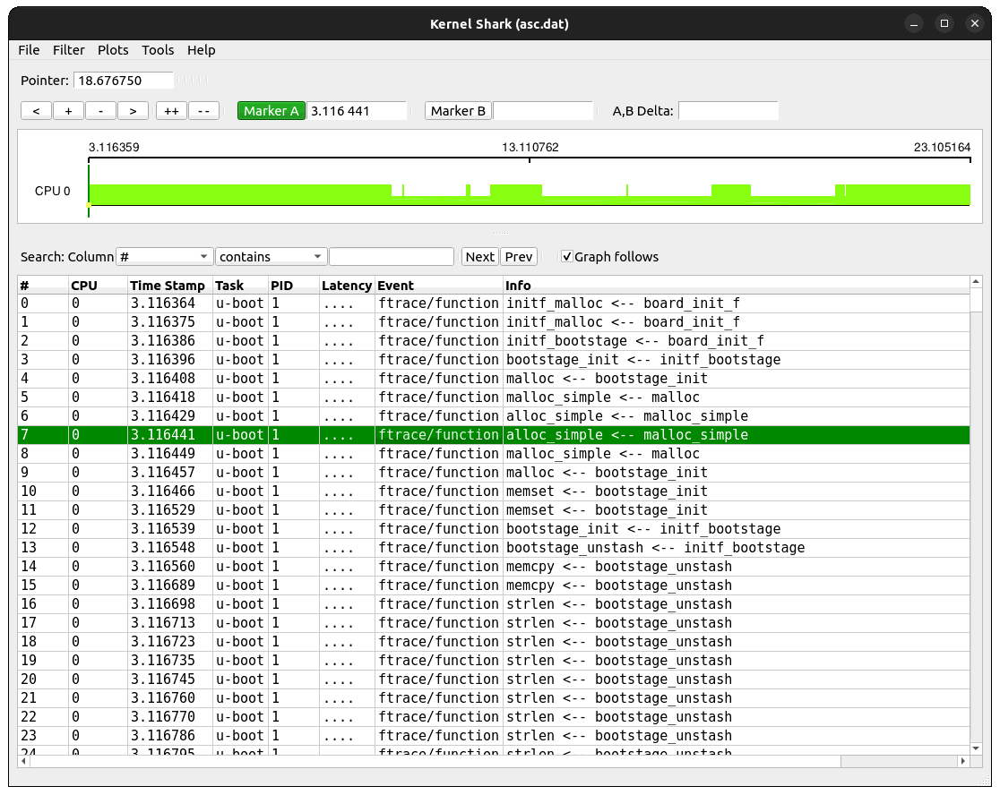
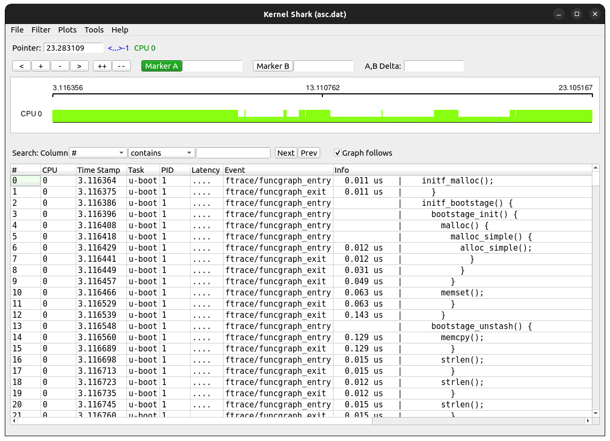
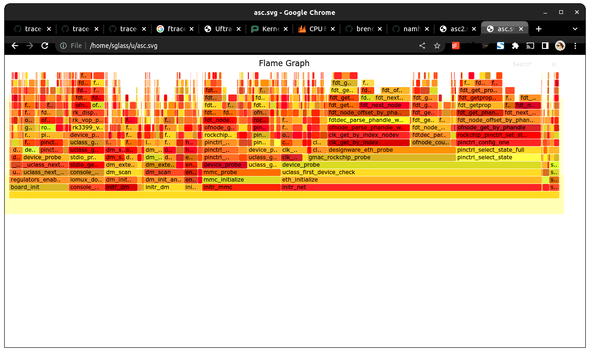
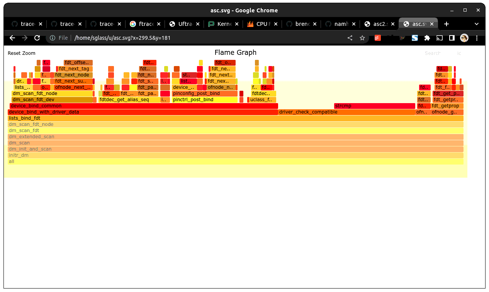
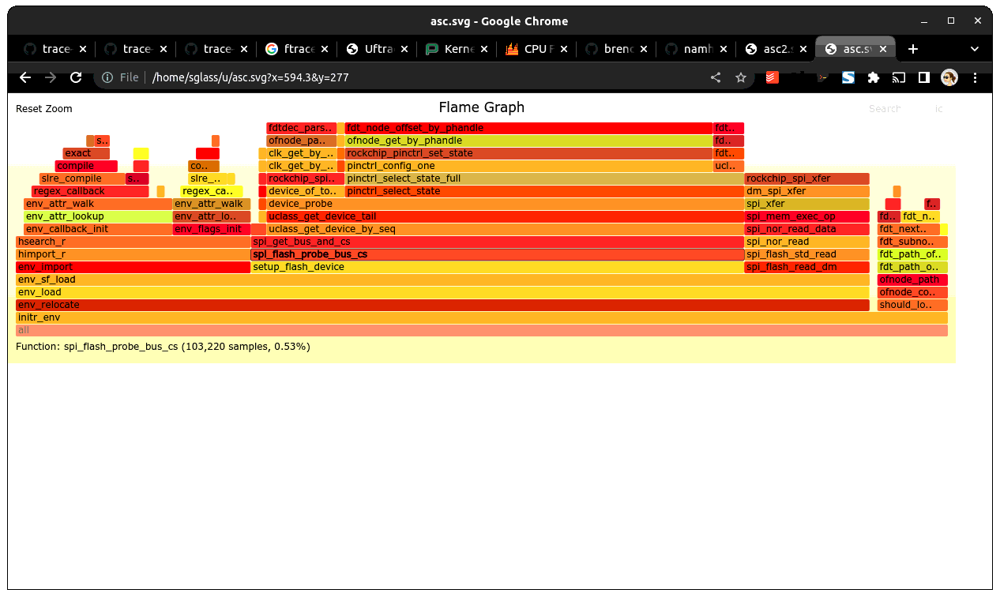

.. SPDX-License-Identifier: GPL-2.0+
.. Copyright (c) 2013 The Chromium OS Authors.

Tracing in U-Boot
=================

U-Boot supports a simple tracing feature which allows a record of execution
to be collected and sent to a host machine for analysis. At present the
main use for this is to profile boot time.

Overview
--------

The trace feature uses GCC's instrument-functions feature to trace all
function entry/exit points. These are then recorded in a memory buffer.
The memory buffer can be saved to the host over a network link using
tftpput or by writing to an attached storage device such as MMC.

On the host, the file is first converted with a tool called 'proftool',
which extracts useful information from it. The resulting trace output
resembles that emitted by Linux's ftrace feature, so can be visually
displayed by kernelshark (see kernelshark_) and used with
'trace-cmd report' (see trace_cmd_).

It is also possible to produce a flame graph for use with flamegraph.pl
(see flamegraph_pl_).

Quick-start using Sandbox
-------------------------

Sandbox is a build of U-Boot that can run under Linux so it is a convenient
way of trying out tracing before you use it on your actual board. To do
this, follow these steps:

Add the following to `config/sandbox_defconfig`:

.. code-block:: c

    CONFIG_TRACE=y

Build sandbox U-Boot with tracing enabled:

.. code-block:: console

    $ make FTRACE=1 O=sandbox sandbox_config
    $ make FTRACE=1 O=sandbox

Run sandbox, wait for a bit of trace information to appear, and then capture
a trace:

.. code-block:: console

    $ ./sandbox/u-boot

    U-Boot 2013.04-rc2-00100-ga72fcef (Apr 17 2013 - 19:25:24)

    DRAM:  128 MiB
    trace: enabled
    Using default environment

    In:    serial
    Out:   serial
    Err:   serial
    =>trace stats
        671,406 function sites
         69,712 function calls
              0 untracked function calls
         73,373 traced function calls
             16 maximum observed call depth
             15 call depth limit
         66,491 calls not traced due to depth
    =>trace stats
        671,406 function sites
      1,279,450 function calls
              0 untracked function calls
        950,490 traced function calls (333217 dropped due to overflow)
             16 maximum observed call depth
             15 call depth limit
          1,275,767 calls not traced due to depth
    =>trace calls 1000000 e00000
    Call list dumped to 00000000, size 0xae0a40
    =>print
    baudrate=115200
    profbase=0
    profoffset=ae0a40
    profsize=e00000
    stderr=serial
    stdin=serial
    stdout=serial

    Environment size: 117/8188 bytes
    =>host save hostfs - 1000000 trace ${profoffset}
    11405888 bytes written in 10 ms (1.1 GiB/s)
    =>reset

Then run proftool to convert the trace information to ftrace format

.. code-block:: console

    $ ./sandbox/tools/proftool -m sandbox/System.map -t trace dump-ftrace -o trace.dat

Finally run kernelshark to display it (note it only works with `.dat` files!):

.. code-block:: console

    $ kernelshark trace.dat

Using this tool you can view the trace records and see the timestamp for each
function.

To see the records on the console, use trace-cmd:

.. code-block:: console

    $ trace-cmd report trace.dat | less
    cpus=1
          u-boot-1     [000]     3.116364: function:             initf_malloc
          u-boot-1     [000]     3.116375: function:             initf_malloc
          u-boot-1     [000]     3.116386: function:             initf_bootstage
          u-boot-1     [000]     3.116396: function:                bootstage_init
          u-boot-1     [000]     3.116408: function:                   malloc
          u-boot-1     [000]     3.116418: function:                      malloc_simple
          u-boot-1     [000]     3.116429: function:                         alloc_simple
          u-boot-1     [000]     3.116441: function:                         alloc_simple
          u-boot-1     [000]     3.116449: function:                      malloc_simple
          u-boot-1     [000]     3.116457: function:                   malloc

Note that `pytimechart` is obsolete so cannot be used anymore.

There is a -f option available to select a function graph:

.. code-block:: console

    $ ./sandbox/tools/proftool -m sandbox/System.map -t trace -f funcgraph dump-ftrace -o trace.dat

Again, you can use kernelshark or trace-cmd to look at the output. In this case
you will see the time taken by each function shown against its exit record.

.. code-block:: console

    $ trace-cmd report trace.dat | less
    cpus=1
              u-boot-1     [000]     3.116364: funcgraph_entry:        0.011 us   |    initf_malloc();
              u-boot-1     [000]     3.116386: funcgraph_entry:                   |    initf_bootstage() {
              u-boot-1     [000]     3.116396: funcgraph_entry:                   |      bootstage_init() {
              u-boot-1     [000]     3.116408: funcgraph_entry:                   |        malloc() {
              u-boot-1     [000]     3.116418: funcgraph_entry:                   |          malloc_simple() {
              u-boot-1     [000]     3.116429: funcgraph_entry:        0.012 us   |            alloc_simple();
              u-boot-1     [000]     3.116449: funcgraph_exit:         0.031 us   |            }
              u-boot-1     [000]     3.116457: funcgraph_exit:         0.049 us   |          }
              u-boot-1     [000]     3.116466: funcgraph_entry:        0.063 us   |        memset();
              u-boot-1     [000]     3.116539: funcgraph_exit:         0.143 us   |        }

The `trace wipe` command may be used to clear the trace buffer. It leaves
tracing in its current enable state. This command is convenient when tracing a
single command, for example:

.. code-block:: console

   => trace pause; trace wipe
   => trace resume; dhcp; trace pause
   => trace stats
   ...

Flame graph
-----------

Some simple flame graph options are available as well, using the dump-flamegraph
command:

.. code-block:: console

    $ ./sandbox/tools/proftool -m sandbox/System.map -t trace dump-flamegraph -o trace.fg
    $ flamegraph.pl trace.fg >trace.svg

You can load the .svg file into a viewer. If you use Chrome (and some other
programs) you can click around and zoom in and out.

A timing variant is also available, which gives an idea of how much time is
spend in each call stack:

.. code-block:: console

    $ ./sandbox/tools/proftool -m sandbox/System.map -t trace dump-flamegraph -f timing -o trace.fg
    $ flamegraph.pl trace.fg >trace.svg

Note that trace collection does slow down execution so the timings will be
inflated. They should be used to guide optimisation. For accurate boot timings,
use bootstage.

CONFIG Options
--------------

CONFIG_TRACE
    Enables the trace feature in U-Boot.

CONFIG_CMD_TRACE
    Enables the trace command.

CONFIG_TRACE_BUFFER_SIZE
    Size of trace buffer to allocate for U-Boot. This buffer is
    used after relocation, as a place to put function tracing
    information. The address of the buffer is determined by
    the relocation code.

CONFIG_TRACE_EARLY
    Define this to start tracing early, before relocation.

CONFIG_TRACE_EARLY_SIZE
    Size of 'early' trace buffer. Before U-Boot has relocated
    it doesn't have a proper trace buffer. On many boards
    you can define an area of memory to use for the trace
    buffer until the 'real' trace buffer is available after
    relocation. The contents of this buffer are then copied to
    the real buffer.

CONFIG_TRACE_EARLY_ADDR
    Address of early trace buffer

CONFIG_TRACE_CALL_DEPTH_LIMIT
    Sets the limit on trace call-depth. For a broad view, 10 is typically
    sufficient. Setting this too large creates enormous traces and distorts
    the overall timing considerable.

Building U-Boot with Tracing Enabled
------------------------------------

Pass 'FTRACE=1' to the U-Boot Makefile to actually instrument the code.
This is kept as a separate option so that it is easy to enable/disable
instrumenting from the command line instead of having to change board
config files.

Board requirements
------------------

Trace data collection relies on a microsecond timer, accessed through
`timer_get_us()`. So the first thing you should do is make sure that
this produces sensible results for your board. Suitable sources for
this timer include high resolution timers, PWMs or profile timers if
available. Most modern SOCs have a suitable timer for this.

See `add_ftrace()` for where `timer_get_us()` is called. The `notrace`
attribute must be used on each function called by `timer_get_us()` since
recursive calls to `add_ftrace()` will cause a fault::

   trace: recursion detected, disabling

You cannot use driver model to obtain the microsecond timer, since tracing
may be enabled before driver model is set up. Instead, provide a low-level
function which accesses the timer, setting it up if needed.

Collecting Trace Data
---------------------

When you run U-Boot on your board it will collect trace data up to the
limit of the trace buffer size you have specified. Once that is exhausted
no more data will be collected.

Collecting trace data affects execution time and performance. You
will notice this particularly with trivial functions - the overhead of
recording their execution may even exceed their normal execution time.
In practice this doesn't matter much so long as you are aware of the
effect. Once you have done your optimizations, turn off tracing before
doing end-to-end timing using bootstage.

The best time to start tracing is right at the beginning of U-Boot. The
best time to stop tracing is right at the end. In practice it is hard
to achieve these ideals.

This implementation enables tracing early in `board_init_r()`, or
`board_init_f()` when `TRACE_EARLY` is enabled. This means
that it captures most of the board init process, missing only the
early architecture-specific init. However, it also misses the entire
SPL stage if there is one. At present tracing is not supported in SPL.

U-Boot typically ends with a 'bootm' command which loads and runs an
OS. There is useful trace data in the execution of that bootm
command. Therefore this implementation provides a way to collect trace
data after bootm has finished processing, but just before it jumps to
the OS. In practical terms, U-Boot runs the 'fakegocmd' environment
variable at this point. This variable should have a short script which
collects the trace data and writes it somewhere.

Controlling the trace
---------------------

U-Boot provides a command-line interface to the trace system for controlling
tracing and accessing the trace data. See :doc:`../usage/cmd/trace`.

Environment Variables
---------------------

The following are used:

profbase
    Base address of trace output buffer

profoffset
    Offset of first unwritten byte in trace output buffer

profsize
    Size of trace output buffer

All of these are set by the 'trace calls' command.

These variables keep track of the amount of data written to the trace
output buffer by the 'trace' command. The trace commands which write data
to the output buffer can use these to specify the buffer to write to, and
update profoffset each time. This allows successive commands to append data
to the same buffer, for example::

    => trace funclist 10000 e00000
    => trace calls

(the latter command appends more data to the buffer).

fakegocmd
    Specifies commands to run just before booting the OS. This
    is a useful time to write the trace data to the host for
    processing.

Writing Out Trace Data
----------------------

Once the trace data is in an output buffer in memory there are various ways
to transmit it to the host. Notably you can use tftput to send the data
over a network link::

    fakegocmd=trace pause; usb start; set autoload n; bootp;
    trace calls 10000000 1000000;
    tftpput ${profbase} ${profoffset} 192.168.1.4:/tftpboot/calls

This starts up USB (to talk to an attached USB Ethernet dongle), writes
a trace log to address 10000000 and sends it to a host machine using
TFTP. After this, U-Boot will boot the OS normally, albeit a little
later.

For a filesystem you may do something like::

    trace calls 10000000 1000000;
    save mmc 1:1 10000000 /trace ${profoffset}

The trace buffer format is internal to the trace system. It consists of a
header, a call count for each function site, followed by a list of trace
records, once for each function call.

Converting Trace Output Data (proftool)
---------------------------------------

The trace output data is kept in a binary format which is not documented
here. See the `trace.h` header file if you are interested. To convert it into
something useful, you can use proftool.

This tool must be given the U-Boot map file and the trace data received
from running that U-Boot. It produces a binary output file.

It is also possible to provide a configuration file to indicate which functions
should be included or dropped during conversion. This file consists of lines
like::

   include-func <regex>
   exclude-func <regex>

where <regex> is a regular expression matched against function names. It
allows some functions to be dropped from the trace when producing ftrace
records.

Options:

-c <config_file>
    Specify the optional configuration file, to control which functions are
    included in the output.

-f <format>
    Specifies the format to use (see below)

-m <map_file>
    Specify U-Boot map file (`System.map`)

-o <output file>
    Specify the output filename

-t <trace_file>
    Specify trace file, the data saved from U-Boot

-v <0-4>
    Specify the verbosity, where 0 is the minimum and 4 is for debugging.

Commands:

dump-ftrace:
    Write a binary dump of the file in Linux ftrace format. Two options are
    available:

    function
        write function-call records (caller/callee)

    funcgraph
        write function entry/exit records (graph)

    This format can be used with kernelshark_ and trace_cmd_.

dump-flamegraph
    Write a list of stack records useful for producing a flame graph. Two
    options are available:

    calls
        create a flamegraph of stack frames

    timing
        create a flamegraph of microseconds for each stack frame

    This format can be used with flamegraph_pl_.

Viewing the Trace Data
----------------------

You can use kernelshark_ for a GUI, but note that version 2.0.x was broken. If
you have that version you could try building it from source.

The file must have a .dat extension or it is ignored. The program has terse
user interface but is very convenient for viewing U-Boot profile information.

Also available is trace_cmd_ which provides a command-line interface.

Workflow Suggestions
--------------------

The following suggestions may be helpful if you are trying to reduce boot
time:

1. Enable CONFIG_BOOTSTAGE and CONFIG_BOOTSTAGE_REPORT. This should get
   you are helpful overall snapshot of the boot time.

2. Build U-Boot with tracing and run it. Note the difference in boot time
   (it is common for tracing to add 10% to the time)

3. Collect the trace information as described above. Use this to find where
   all the time is being spent.

4. Take a look at that code and see if you can optimize it. Perhaps it is
   possible to speed up the initialization of a device, or remove an unused
   feature.

5. Rebuild, run and collect again. Compare your results.

6. Keep going until you run out of steam, or your boot is fast enough.

Configuring Trace
-----------------

There are a few parameters in the code that you may want to consider.
There is a function call depth limit (set to 15 by default). When the
stack depth goes above this then no tracing information is recorded.
The maximum depth reached is recorded and displayed by the 'trace stats'
command. While it might be tempting to set the depth limit quite high, this
can dramatically increase the size of the trace output as well as the execution
time.

Future Work
-----------

Tracing could be a little tidier in some areas, for example providing
run-time configuration options for trace.

Some other features that might be useful:

- Trace filter to select which functions are recorded
- Sample-based profiling using a timer interrupt
- Better control over trace depth
- Compression of trace information

.. sectionauthor:: Simon Glass <sjg@chromium.org>
.. April 2013
.. Updated January 2023

.. _kernelshark: https://kernelshark.org/
.. _trace_cmd: https://www.trace-cmd.org/
.. _flamegraph_pl: https://github.com/brendangregg/FlameGraph/blob/master/flamegraph.pl
